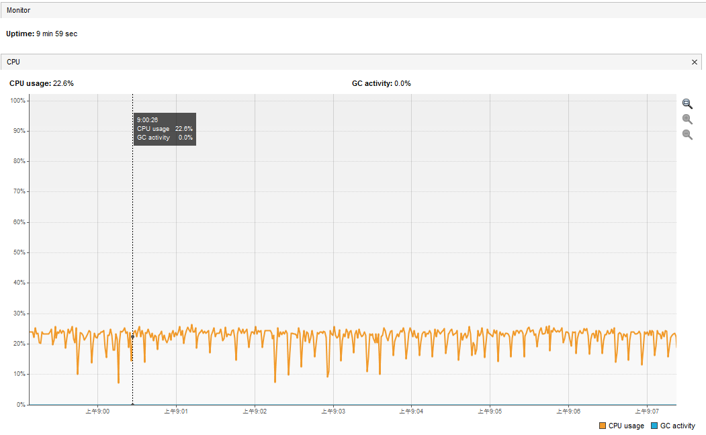
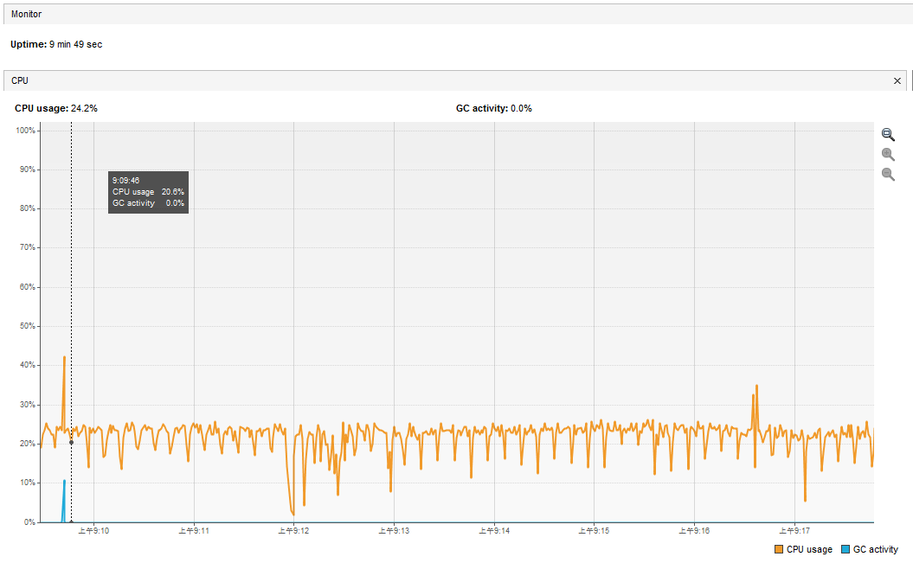
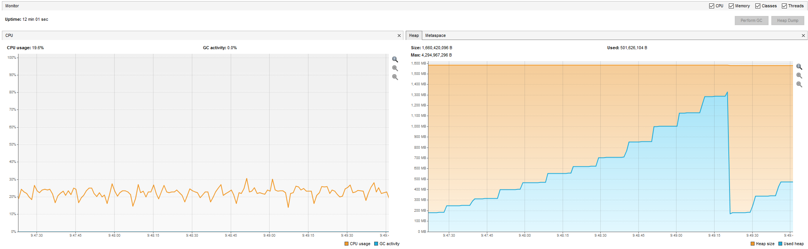

**声明：**该性能测试，仅针对解析binlog对项目的性能影响，解析后的binlog暂未分发给任何业务。

**测试环境**：windos10，4核，16g内存。

**集成前后：**测试非压测场景下，集成`mysql-binlog-connector-java`前后，系统的CPU负载变化。

从两个图的对比可以看出，在常规场景下，全量解析binlog，并未给系统带来CPU负载的显著升高。

集成前：

集成后：

**压力测试**：在5w、10w条数据库数据变化下，测试系统性能负载。

堆内存在5w条数据库数据变化时，增长不超过100M；10w不超过200M；增加的内存随GC触发释放。

CPU负载无显著升高，目前分析，CPU负载压力，主要不会来自解析binlog，而是后续对binlog事件的业务处理。

**耗时测试：**在1w、5w、10w条数据库数据变化下，测试binlog解析耗时。

| 并发数 | 耗时1 | 耗时2 | 耗时3 | 耗时4 | 耗时5 | 平均耗时（ms） |
| ------ | ----- | ----- | ----- | ----- | ----- | -------------- |
| 1w     | 56    | 56    | 54    | 51    | 58    | 55             |
| 5w     | 358   | 354   | 360   | 364   | 382   | 363.6          |
| 10w    | 780   | 765   | 795   | 767   | 775   | 656.4          |

