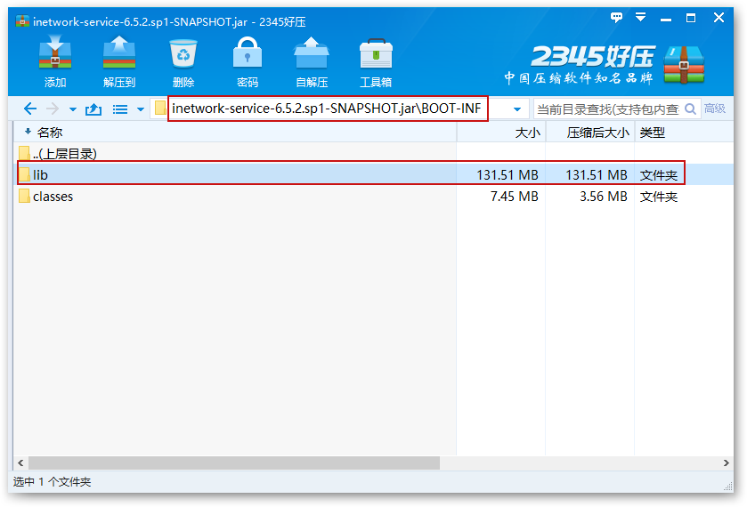
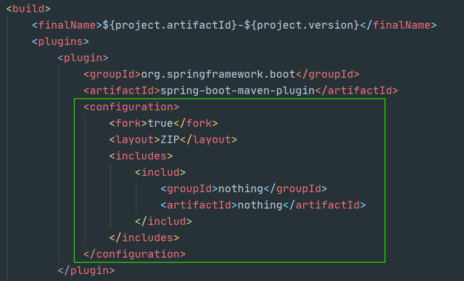
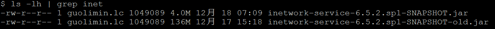
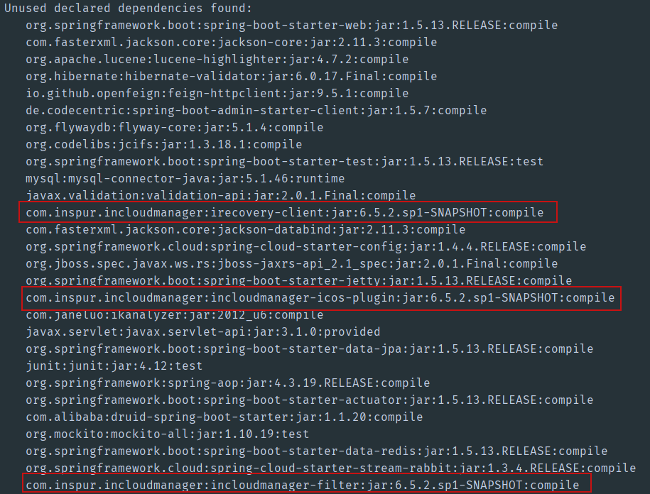

问题：

3. 减少cmp总包大小，有意义么？需要跟领导沟通一下
2. 容器里的java项目是怎么启动的？命令存在哪里了，deploy是不是
3. 在容器里，怎么引用容器外面的lib库
4. 这个插件是干嘛的，需要了解一下
5. Dockerfile文件内容有没有必要了解下

# 一、引用公共lib库

## 1.1. 单体项目

1. 正常打包`inetwork-service`，然后将jar包中的lib拷贝出来

   

2. 在`inetwork-service`项目的`pom`中增加配置配置，如下图

   

   ```xml
   <plugin>
       <groupId>org.springframework.boot</groupId>
       <artifactId>spring-boot-maven-plugin</artifactId>
       <configuration>
           <fork>true</fork>
           <layout>ZIP</layout>
           <includes>
               <includ>
                   <groupId>nothing</groupId>
                   <artifactId>nothing</artifactId>
               </includ>
           </includes>
       </configuration>
   </plugin>
   ```

3. 重新打包`inetwork-service`，两次打包jar包大小如下图：

   

4. 将步骤1中拷贝出的`lib`文件夹，复制到`jar`包同级目录下，执行如下命令：

   ```sh
    java -Dloader.path="lib/" -jar inetwork-service-6.5.2.sp1-SNAPSHOT.jar
   ```

   项目可以正常启动。

## 1.2. 镜像

1. 使用新旧方法打出的镜像大小如下图，镜像大小减少**138M**：	

   目前CMP模块大约有30个，该方案初步估计大约可以减少**2g**多的镜像包大小。

## 1.3.存在问题

1. 现场单独升级一个pod或几个pod之后，要更新整个lib库，或者有办法识别到lib库的变更，单独更新这些变更。

# 二、清理无用依赖

1. 使用命令`mvn dependency:analyze`分析。

   如下图所示，分析了`inetwork-service`模块的冗余依赖，其中红框部分是可以很明显的确定可以清除的依赖。

   

   这些依赖清除之后，则该依赖本身及通过它依赖传递过来的依赖，都可以移除。


其他：

1. mvn clean package -Dmaven.test.skip=true
2. docker build -t 100.2.96.162:8089/icmp/amd64/inetwork-service-old:20221218 -f ./inetwork-service/src/main/docker/Dockerfile --build-arg 'ZIP_FILE=inetwork-service/target/inetwork-service-*.tar' --build-arg BASE_IMAGE_REPO=incloudos --build-arg OPENJDK_IMAGE_TAG=8u282-0.0.2 --build-arg BUILD_ARCH=amd64 --build-arg BASE_IMAGE_REGISTRY=100.2.96.162:8089 --no-cache=true .