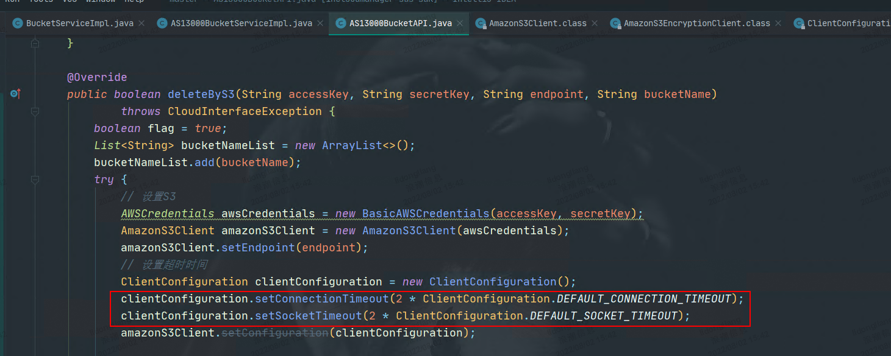
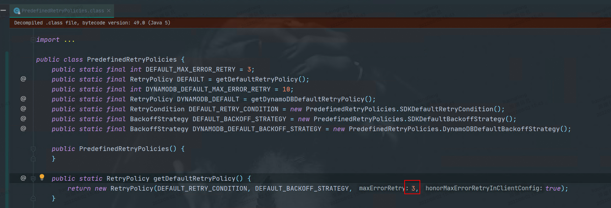
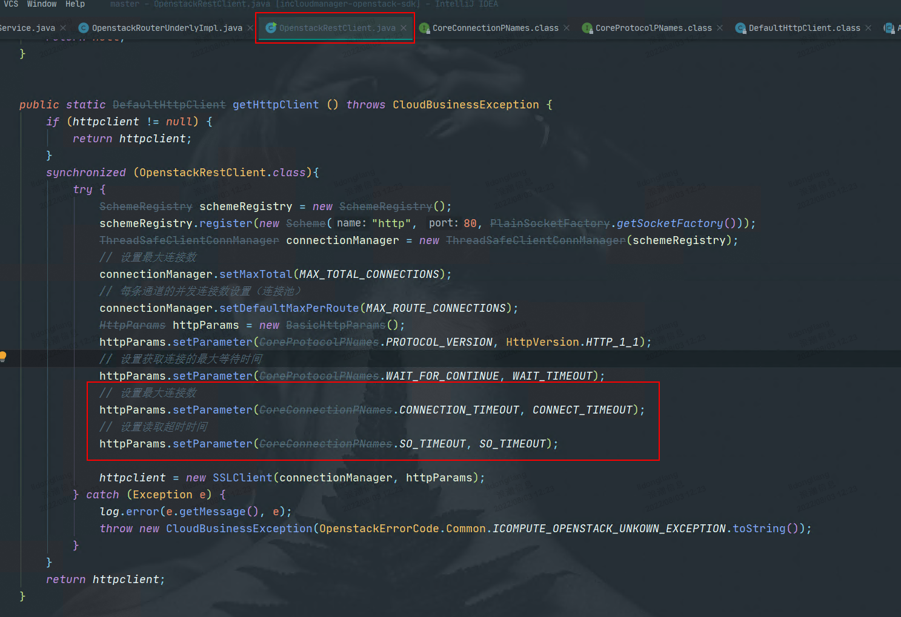
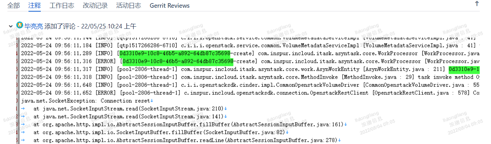

[toc]


**需求： 实现调用icos接口的重试机制，提高接口调用的容错率，保证系统可靠性运行**

# 一、场景分析

1. **批量删除，icos接口返回404**（这里所谓的批量删除，是指页面多选，循环调用接口）

   网络模块，例如删除防火墙、防火墙规则，目前网络模块的处理方式是抛出异常：“操作过于频繁，请稍后重试”，让用户自己手动重试（让用户自己重试，也是一种很好的方法）。

   云物理机模块，例如删除裸金属节点，目前云物理机模块的处理方式是在代码里重试几次。

   582之前有这个问题，v6没再遇见过，可能是社区代码升级解决了。

   —- 考虑是否底层已删除，上层未置为失效，考虑这个场景需要处理不

   

2. **接口连接超时**

   ingress服务停掉、icos挂掉，或网络问题（延迟、抖动或者丢包），会出现连接超时，报错“connect timed out”。

   

   例如上海临港算力项目，删除对象存储，一直删除中，原因是网络连接异常，无法删除掉对象存储中的存储桶。对象存储项目，使用的AmazonS3Client，它是有重试机制的。这个场景下，超过重试次数之后，网络仍然连接不上。

   AmazonS3Client连接超时，100s。响应超时，100s。

   

   AmazonS3Client默认重试次数：3次。

   

   

   调用OpenStack接口，最终都会调用OepnstackRestClient.getHttpClient()获取httpClient，在该方法中设置了连接超时时间：100s，响应超时：600s，使用的是DefaultHttpClient，没有重试机制。

   

   –– 连接超时应该设置多少合适，确定参考依据。

   —- 需要重试

3. **接口响应超时**

   例如bug PHELPSD-1793，创建云硬盘，icos cinder模块连接数据库超时，导致创建接口超时。

   – 响应超时，错误信息是啥

   – 考虑同步、异步调用的问题。异步不需要处理

   – 查询可以重试，创建、更新、删除的重试有风险。确认下更新、删除是否可重复执行。

   

4. **接口调用失败客户端问题，响应状态码4XX** 

   场景举例：

   - 删除不存在的子网，状态码404 Not Found，报错“Subnet xxx could not be found”。

   - 删除存在虚拟机网卡的子网，状态码409 Conflict，报错“Unable to complete operation on subnet …”。

   - 创建子网，cidr和网络下其他子网重叠，状态码400 Bad Request，报错“Invalid inpurt for operation:….”

   针对这类问题，目前通常的处理方式是抛出异常，在UI页面上给出合理提示。

   – 不需要重试

   

5. **接口调用失败服务端问题，响应状态码500**

   500状态码代表因服务端内部错误产生的系统异常。

   场景举例：

   - 创建子网时，neutron连不上数据库，返回 500 Internal Server Error。
   - 服务暂时不可用，第一次调用失败，但是再次尝试就会成功（这个场景我们遇到过，但是目前没有对应bug）。

   – 500不一定完全是服务端系统问题，也可能是icos业务问题。

   – 也要考虑是否可重复执行，比如查询可以，创建、删除、更新需要考虑。

   – 重试风险：

   – icos待办：什么情况下返回500。找广峰。

   

6. **接口调用失败服务不可用，返回503**

   产生原因是cmp后台可以连通icos，请求能够发到icos的ingress上，但是具体的服务无法访问。

   例如neutron服务停掉，调用接口删除子网，状态码503 Service Temporarily Unavalilable，由nginx抛出。

   – 深入确认一下，是否一定是ingress问题。如果是的话，需要增加重试。

   

7. **未返回预期结果的重试**

   例如创建负载均衡，调用icos异步创建lb接口之后，轮询查询icos的lb状态，直到配置状态变为active。

   这类问题通常是结合具体的业务功能来处理的。

   – 不需要处理

   

   1. **Connection reset，连接重置**

   服务端由于某种原因关闭了tcp连接，而此时客户端仍在读写数据，则客户端会收到服务端发送的rst包（连接复位）：

   - 如果此时客户端正在从Socket的输出流中读数据，则报错“Connection reset”。

   - 如果此时客户端正在从Socket的输入流中写数据，则报错“Connection reset by peer”。

     

   例如bug PHELPSD-1793，创建云硬盘，icos报错 Connection reset。

   

   

   

   – 统一云，创建云主机，获取云主机详情，报错connect reset。上传镜像，也可能会出现

   – 查询可以重试，创建、删除、更新有风险

8. – 504，网关的问题，这个需要不需要重试？加速器绑定，会出现504。nginx抛出来的。

9. – 超时时间30s，某些场景下，是否合理？ 比如创建云连接跨域时间长。是否可以改成可配置，根据现场实际环境调整。

10. 待讨论

   - 还有哪些调用icos接口失败的场景么？
   - 以上场景哪些需要处理，哪些需要在公共位置处理，哪些需要在具体业务处处理？– 
   - – 梳理表格

# 二、风险

1. **重试会加大直接下游的负载**

   如下图，假设因为Service B负载过高，导致Service A调用Service B服务失败。如果这里有重试机制，重试次数设置为n。A重新调用B，不仅不会请求成功，还可能导致B的负载继续升高，最坏的情况下可能放大n倍，甚至直接打挂。

   

   

   可以增加断路器，根据请求失败/成功的比率，给重试增加熔断功能。比如设置这个比率为0.1，当新增失败请求时，判断前10s失败/成功比率是否已打到这个阈值，如果达到则不再重试。

   

2. **重试还会存在链路放大效应**

   如下图所示，如果B调用DB失败，B的重试次数设置为n，B重试n次之后返回失败结果给A；A本身的重试次数设置为m，则链路上的重试次数将为`n*m`；如果系统的访问量为r，则系统内的重试次数为`r*n*m`。如果层数继续加深，那么重试次数将继续呈指数级扩大。这种指数放大的效应很可怕，可能导致链路上多层都被打挂，整个系统雪崩。

   

   
   
   在cmp中，假如网络调nutron接口，500重试，重试次数为3次；计算调用网络接口，500重试，重试次数为3次，这样是不是就产生了链路放大效应。
   
   将重试机制仅加在调用icos层，是不是可以解决这个问题？

# 三、IDC重试机制

> IDC在调用ics或vmware处，存在重试机制。重试条件为token过期，重试次数为5次。

详细介绍如下：

idc对底层ics或vmware的调用，集中封装在一系列如NetworkRemoteService、ComputeRemoteService、StorageRemoteService等接口中。

idc通过JDK动态代理，为每个接口创建一个代理，当需要调用ics或vmware方法时，实际上使用的是这个代理类。


在动态代理处理器中，调用方法并捕获异常，如果判断是token过期，则重试。


参考代码：CloudProxyClient。

# 四、解决方案

1. 重试要考虑的问题
   - **代码位置**。重试代码写在哪？写在具体业务处、aop中，或者还是httpClient？如何降低对业务代码的侵入，进而减少业务接入的成本？
   - **触发条件**。4xx要重试么？5xx要重试么？连接超时要重试么？响应超时要重试么？抛出指定异常重试么？未获取到预期结果要重试么？
   - **停止重试条件**。最大重试次数，还是最长执行时长之后停止重试？还是二者结合？重试次数设置多少合适？
   - **退避策略**。决定等待多久之后再重试的方法叫退避策略，常见的退避策略包含以下三种：
     - **线性退避**：每次等待固定时间后重试
     - **随机退避**：在一定范围内随机等待一个时间后重试。这个策略的好处在于，打散上游重试的时间，从而较少因为同时都重试而导致下游瞬间流量高峰。
     - **指数退避**：连续重试时，每次等待时间都是前一次的倍数。例如tcp的超时重传，采用的是二进制退避原则，{1， 2， 4， 8， 16}这样成倍的扩大超时时间。采用这个策略的原因是，tcp认为丢包意味着网络存在拥塞，为了不加重网络的拥塞，tcp选择等待更长的时间再进行重传。
     - – 采用线性
2. 可以采用的技术手段
   1. 动态代理
   
      - 参照idc的重试机制，在动态代理中，手动添加重试机制
   
      - 技术手段：
        - 动态代理
          - JDK动态代理
          - CGLib动态代理
        - spring aop
   
      - 缺点：重复造轮子，需要自己构造触发条件、停止重试条件、退避策略
   
   2. 方法级重试

      - spring-retry
   
        1. 定义重试配置
   
           ```java
           @Configuration
           public class RetryConfig {
               @Bean
               public RetryTemplate retryTemplate() {
                   // 定义简易重试策略，最大重试次数为3次，重试间隔为3s
                   RetryTemplate retryTemplate = RetryTemplate.builder()
                       .maxAttempts(3)
                       .fixedBackoff(3000)
                       .retryOn(RuntimeException.class)
                       .build();
                   retryTemplate.registerListener(new MyRetryListener());
                   return retryTemplate;
               }
           
           }
           ```
   
        2. 可以代码中直接使用
   
           ```java
           @Service
           @Slf4j
           public class SpringRetryImperativeService {
               
               @Autowired
               RetryTemplate retryTemplate;
               
               @Autowired
               CommonService commonService;
           
               public void test() {
                   retryTemplate.execute(
                           retry -> {
                               commonService.test("命令式");
                               return null;
                           },
                           recovery -> {
                               commonService.recover("命令式");
                               return null;
                           }
                   );
               }
           }
           
           ```
   
        3. 也可以通过注解方式使用
   
           ```java
           @Service
           @Slf4j
           public class SpringRetryAnnotationService {
              
               @Autowired
               CommonService commonService;
           
               /**
                * 如果失败，定义重试3次，重试间隔为3s，指定恢复名称,指定监听器
                */
               @Retryable(value = RuntimeException.class, maxAttempts = 3, backoff = @Backoff(value = 3000L), recover = "testRecover", listeners = {"myRetryListener"})
               public void test() {
                   commonService.test("注解式");
               }
           
               @Recover
               public void testRecover(RuntimeException runtimeException) {
                   commonService.recover("注解式");
               }
           }
           
           ```
   
        4. 它还可以定义重试监听器，监听重试过程的生命周期，打印重试过程。
   
           – 改造我们程序的例子，使用它写下
   
      - guava-retrying
   
        -  guava-retrying是Google Guava库的一个扩展包，功能与spring-retry类似，暂不展开。
   
   3. 公共位置重试
   
      - HttpClient默认重试机制
   
        - 重试次数：3次
   
        - 重试条件（ 源码参考DefaultHttpRequestRetryHandler.retryRequest( ) ）
   
          ```java
       @Override
          public boolean retryRequest(final IOException exception, final int executionCount, final HttpContext context) {
   
              // 1.判断重试次数：达到上限不重试，默认3次
         if (executionCount > this.retryCount) {
                  return false;
         }
          
          ```
   
     	/*
          	 * 2.判断异常类型，以下异常不重试：
     	 *      InterruptedIOException：I/O操作中断，原因是执行此操作的线程中断。
          	 *      UnknownHostException：DNS解析域名失败。
     	 *      ConnectException：tcp握手失败，通常是因为服务端拒绝连接，例如服务端未监听该端口。
          	 *      SSLException：SSL相关操作失败。
          	 * 注：这四个异常都是IOException的子类。
   
          	 */
           if (this.nonRetriableClasses.contains(exception.getClass())) {
                  return false;
           } else {
                  // 如果是上面四种异常的子类，也不重试
               for (final Class<? extends IOException> rejectException : this.nonRetriableClasses) {
                      if (rejectException.isInstance(exception)) {
                          return false;
                      }
                  }
              }
              final HttpClientContext clientContext = HttpClientContext.adapt(context);
              final HttpRequest request = clientContext.getRequest();
          
              // 3.当前请求已被终止（当请求被放在异步任务中，而异步任务被cancel的时候）
              if(requestIsAborted(request)){
                  return false;
              }
          
              // 4.判断幂等性：如果是幂等的就重试，非HttpPost、HttpPut、HttpPatch
              if (handleAsIdempotent(request)) {
                  return true;
              }
          
              // 5.
              if (!clientContext.isRequestSent() || this.requestSentRetryEnabled) {
                  // Retry if the request has not been sent fully or
                  // if it's OK to retry methods that have been sent
                  return true;
              }
          
              // 6.其他情况不重试
              return false;
          }
          ```
          
        - 支持自定义重试条件（可以按照异常、错误码等进行重试）
          
          ```java
        public static void main(String[] args) {
              HttpClient client = HttpClients.custom()
                  .setRetryHandler(new HttpRequestRetryHandler() {
                      @Override
                      public boolean retryRequest(IOException e, int executionCount, HttpContext httpContext) {
          
                          if (executionCount > 3) {
                              return false;
                          }
          
                          if (e instanceof ConnectException) {
                              return false;
                          }
          
                          return false;
                      }
                  })
                  .build();
          }
          ```
          
        - 关于httpclient
          
          - 目前项目内使用的版本是4.5.5
          - 对象存储自己封装的httpClient方法，有重试机制
          - 调用openstack接口的openstackRestClient中使用的httpClient是defaultHttpClient，默认没有重试机制
   
      - feign重试机制
      
        - 这个目前是不是不需要考虑，因为feign主要针对的是模块间的调用，和调用icos接口无关
   

# 五、其他

## 5.1.非标准场景

1. **状态码未按http标准定义**

   例如bug PHELPSA-1627，“保护中”状态的保护组，执行“开启保护”动作，状态码500，报错：“The operation was not performed because it is not valid given the current consistency group state”。

   例如bug PHELPSA-2735，“未保护”状态的保护组，执行“故障切换”动作，状态码500，报错：“The operation was not performed because it is not valid given the current consistency group state”。

   这些是客户端问题，而不是服务端问题，所以应该返回错误码4xx，而不是500。这个接口没有按照http标准定义状态码。

   

   再比如bug PHELPS-6014，vdc绑定大数据资源池失败，状态码500，报错：“bind user resource failed”，大数据也没按照http标准定义状态码。

## 5.2.其他问题

- 判断请求报文是否已经完成发送，若未完成发送才可以重试。
- 重试代码中打印日志，打印重试次数之类的信息。
- 要考虑网关的30s超时时间。
- 开源项目通常是如何处理这种问题的。
- 例如创建云主机的请求，如果带着requestId，nova收到两个相同的requestId的请求，会不处理第二次么？如果是的话，是不是创建响应超时也可以重试？

 

参考资料：

1. https://segmentfault.com/a/1190000039890909 - 请求失败，应该重试么？
2. https://ld246.com/article/1572277642298 - connection reset
3. https://blog.csdn.net/noaman_wgs/article/details/85940207 - 接口重试机制的最佳实践 - Guava-retrying的应用
4. https://juejin.cn/post/6844903910805602312 - 各种重试手段总结
5. https://www.infoq.cn/article/5fboevkal0gvgvgeac4z -  如何优雅地重试_架构_字节跳动技术团队 
6. https://segmentfault.com/a/1190000037713035 - HttpClient的两种重试机制
7. https://www.cnblogs.com/kingszelda/p/8886403.html - 关于HttpClient重试策略的研究
8. https://www.jianshu.com/p/76dd602d8151 - httpclient 责任链执行分析
9. https://www.cnblogs.com/keeya/p/13559151.html - Spring Cloud Feign 自定义配置
10. https://segmentfault.com/a/1190000040680716 - 动态代理
11. https://blog.csdn.net/weixin_41307800/article/details/124604598 - spring-retry使用介绍
12. https://blog.csdn.net/yubin1285570923/article/details/124293065 - 重试机制：Guava Retrying与spring-retry