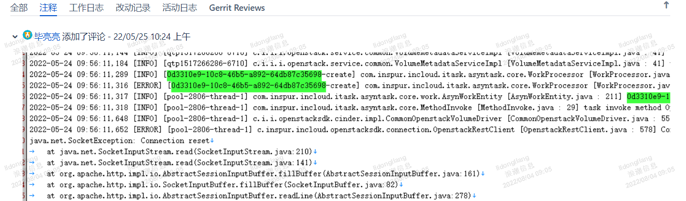
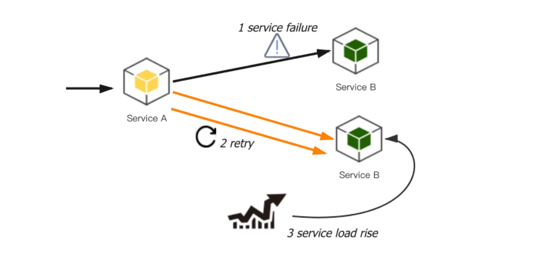
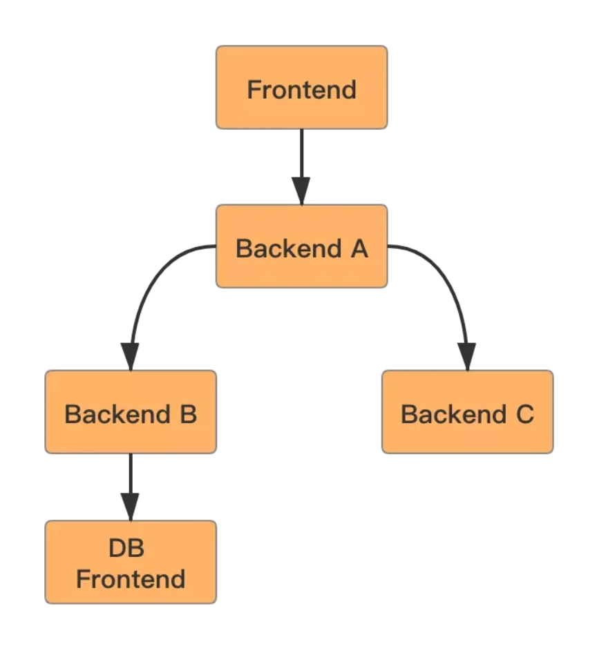
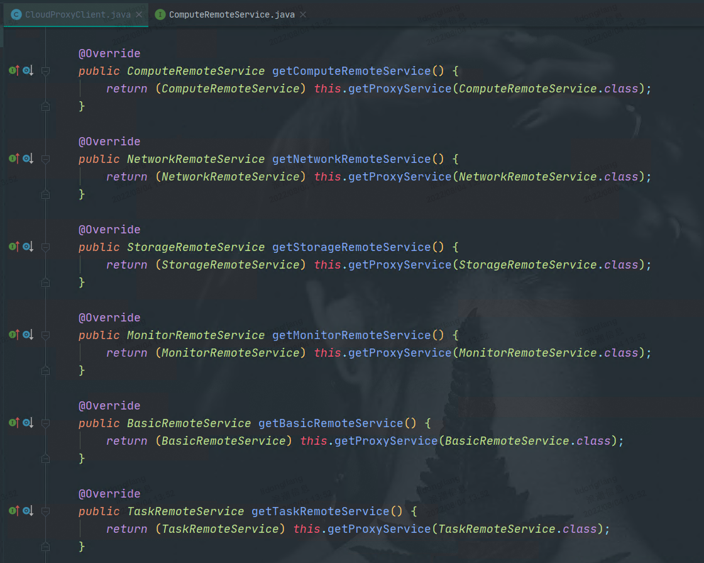

[toc]


**需求： 实现调用icos接口的重试机制，提高接口调用的容错率，保证系统可靠性运行**

# 一、场景分析

1. **接口调用失败**

   ingress服务停掉、icos挂掉，或网络问题（延迟、抖动或者丢包），会出现连接超时，报错“connect timed out”。

   

   例如上海临港算力项目，删除对象存储，一直删除中，原因是网络连接异常，无法删除掉对象存储中的存储桶。对象存储项目，使用的AmazonS3Client，它是有重试机制的。这个场景下，超过重试次数之后，网络仍然连接不上。

   AmazonS3Client连接超时，100s。响应超时，100s。

   

   AmazonS3Client默认重试次数：3次。

   

   

   调用OpenStack接口，最终都会调用OepnstackRestClient.getHttpClient()获取httpClient，在该方法中设置了连接超时时间：100s，响应超时：600s，使用的是DefaultHttpClient，没有重试机制。

   

   

2. **接口响应超时**

   例如bug PHELPSD-1793，创建云硬盘，icos cinder模块连接数据库超时，导致创建接口超时。

   

3. **接口调用失败服务端问题，响应状态码500**

   500状态码代表因服务端内部错误产生的系统异常。

   场景举例：

   - 创建子网时，neutron连不上数据库，返回 500 Internal Server Error。
   - 服务暂时不可用，第一次调用失败，但是再次尝试就会成功（这个场景我们遇到过，但是目前没有对应bug）。

   500不一定完全是服务端系统问题，也可能是icos业务问题。

   

4. **接口调用失败服务不可用，返回503**

   产生原因是cmp后台可以连通icos，请求能够发到icos的ingress上，但是具体的服务无法访问。

   例如neutron服务停掉，调用接口删除子网，状态码503 Service Temporarily Unavalilable，由nginx抛出。

   

5. **Connection reset，连接重置**

  服务端由于某种原因关闭了tcp连接，而此时客户端仍在读写数据，则客户端会收到服务端发送的rst包（连接复位）：

  - 如果此时客户端正在从Socket的输出流中读数据，则报错“Connection reset”。

  - 如果此时客户端正在从Socket的输入流中写数据，则报错“Connection reset by peer”。

    

  例如bug PHELPSD-1793，创建云硬盘，icos报错 Connection reset。

  

  

  

6.  **504 Gateway timeout，网关超时**

   cmp调用icos的流程：cmp -> icos ingress -> 具体服务（例如neutron、nova）->keystone认证。

   超时时间是在icos ingress中设置的，当前响应超时时间为6h，配置如下：

   ```yml
   # 设置从代理服务器读取响应的超时时间（以秒为单位）
   nginx.ingress.kubernetes.io/proxy-read-timeout: "21600"
   
   # 设置将请求传输到代理服务器的超时时间（以秒为单位）
   nginx.ingress.kubernetes.io/proxy-send-timeout: "21600"
   ```

   所以，目前来看，cmp调用icos接口，不会出现504问题。
   


需要重试的场景：

|      |                  问题                   |                           场景举例                           |                           是否重试                           |
| :--: | :-------------------------------------: | :----------------------------------------------------------: | :----------------------------------------------------------: |
|  1   |                连接超时                 |  ingress服务停掉、icos挂掉，或网络问题（延迟、抖动或者丢包   |                              是                              |
|  2   |                响应超时                 |            异步创建云硬盘，icinder连接不上数据库             | 查询重试，创建、更新、删除根据具体icos接口是否可重复执行来决定 |
|  3   | 500 Internal Server Error服务端内部错误 |               创建子网时，neutron连不上数据库                | 查询重试，其余情况需要针对特定场景，以及icos接口是否可重复执行来判断 |
|  4   |  503 Service Unavailable服务端不可访问  |              neutron服务停掉，调用接口删除子网               |                                                              |
|  5   |     504 Gateway timeout    网关超时     |                              \                               |             目前响应超时时间为6h，不会出现该场景             |
|  6   |        Connection reset连接重置         | 服务端由于某种原因关闭了tcp连接，而此时客户端仍在读写数据。例如bug PHELPSD-1793，创建云硬盘，icos报错 Connection reset。 | 查询重试，创建、更新、删除根据具体icos接口是否可重复执行来决定 |

# 二、重试风险

1. **重试会加大直接下游的负载**

   如下图，假设因为Service B负载过高，导致Service A调用Service B服务失败。如果这里有重试机制，重试次数设置为n。A重新调用B，不仅不会请求成功，还可能导致B的负载继续升高，最坏的情况下可能放大n倍，甚至直接打挂。

   

   

   可以增加断路器，根据请求失败/成功的比率，给重试增加熔断功能。比如设置这个比率为0.1，当新增失败请求时，判断前10s失败/成功比率是否已打到这个阈值，如果达到则不再重试。

   

2. **重试还会存在链路放大效应**

   如下图所示，如果B调用DB失败，B的重试次数设置为n，B重试n次之后返回失败结果给A；A本身的重试次数设置为m，则链路上的重试次数将为`n*m`；如果系统的访问量为r，则系统内的重试次数为`r*n*m`。如果层数继续加深，那么重试次数将继续呈指数级扩大。这种指数放大的效应很可怕，可能导致链路上多层都被打挂，整个系统雪崩。

   

   
   
   在cmp中，假如网络调nutron接口，500重试，重试次数为3次；计算调用网络接口，500重试，重试次数为3次，这样是不是就产生了链路放大效应。
   
   将重试机制仅加在调用icos层，是不是可以解决这个问题？

# 三、IDC重试方案

> IDC在调用ics或vmware处，存在重试机制。重试条件为token过期，重试次数为5次。

详细介绍如下：

idc对底层ics或vmware的调用，集中封装在一系列如NetworkRemoteService、ComputeRemoteService、StorageRemoteService等接口中。

idc通过JDK动态代理，为每个接口创建一个代理，当需要调用ics或vmware方法时，实际上使用的是这个代理类。



在动态代理处理器中，调用方法并捕获异常，如果判断是token过期，则重试。


参考代码：CloudProxyClient。

# 四、解决方案

1. 重试要考虑的问题
   - **代码位置：**通用需重试场景，在HttpClient处处理。特定重试场景，使用Spring-retry处理。
   - **触发条件：**捕获到指定异常。
   - **停止重试条件**：重试次数、最大重试时间。
   - **退避策略**。决定等待多久之后再重试的方法叫退避策略，常见的退避策略包含以下三种：
     - **线性退避**：每次等待固定时间后重试
     - **随机退避**：在一定范围内随机等待一个时间后重试。这个策略的好处在于，打散上游重试的时间，从而较少因为同时都重试而导致下游瞬间流量高峰。
     - **指数退避**：连续重试时，每次等待时间都是前一次的倍数。例如tcp的超时重传，采用的是二进制退避原则，{1， 2， 4， 8， 16}这样成倍的扩大超时时间。采用这个策略的原因是，tcp认为丢包意味着网络存在拥塞，为了不加重网络的拥塞，tcp选择等待更长的时间再进行重传。
2. 可以采用的技术手段
   1. 动态代理
   
      - 参照idc的重试机制，在动态代理中，手动添加重试机制
   
      - 技术手段：
        - 动态代理
          - JDK动态代理
          - CGLib动态代理
        - spring aop
   
      - 缺点：重复造轮子，需要自己构造触发条件、停止重试条件、退避策略
   
   2. 类、方法级重试

      - spring-retry
   
        - 使用方式（可以结合示例代码来看）
   
          1. 直接调用
   
             1. 引入依赖
   
             2. 配置RetryTemplate（核心问题）
             3. 使用
   
          2. 使用注解
             1. 启动类加上@EnableRetry注解。
             2. 方法上增加@Retryable注解，该注解可以作用于方法上，也可以作用于类上。
   
        - 版本
   
          - spring-boot-1.5.13.RELEASE默认管理的spring-retry版本为1.2.2.RELEASE。
   
        - 它还可以定义重试监听器，监听重试过程的生命周期，打印重试过程。
   
      - guava-retrying
   
        -  guava-retrying是Google Guava库的一个扩展包，功能与spring-retry类似，暂不展开。
   
   3. 公共位置重试
   
      - HttpClient默认重试机制
   
        - 重试次数：3次
   
        - 重试条件（ 源码参考DefaultHttpRequestRetryHandler.retryRequest( ) ）
   
          ```java
      @Override
              public boolean retryRequest(final IOException exception, final int executionCount, final HttpContext context) {
   
                  // 1.判断重试次数：达到上限不重试，默认3次
                if (executionCount > this.retryCount) {
                      return false;
                }
          
                  /*
                   * 2.判断异常类型，以下异常不重试：
                   *      InterruptedIOException：I/O操作中断，原因是执行此操作的线程中断。
                   *      UnknownHostException：DNS解析域名失败。
                   *      ConnectException：tcp握手失败，通常是因为服务端拒绝连接，例如服务端未监听该端口、服务器未运行、服务器不在网络中。
                   *      SSLException：SSL相关操作失败。
                   * 注：这四个异常都是IOException的子类。
                   */
                  if (this.nonRetriableClasses.contains(exception.getClass())) {
                      return false;
                  } else {
                      // 如果是上面四种异常的子类，也不重试
                      for (final Class<? extends IOException> rejectException : this.nonRetriableClasses) {
                          if (rejectException.isInstance(exception)) {
                              return false;
                          }
                      }
                  }
                  final HttpClientContext clientContext = HttpClientContext.adapt(context);
                  final HttpRequest request = clientContext.getRequest();
          
                  // 3.当前请求已被终止（当请求被放在异步任务中，而异步任务被cancel的时候）
                  if(requestIsAborted(request)){
                      return false;
                  }
          
                  // 4.判断幂等性：如果是幂等的就重试，非HttpPost、HttpPut、HttpPatch
                  if (handleAsIdempotent(request)) {
                      return true;
                  }
          
                  // 5.
                  if (!clientContext.isRequestSent() || this.requestSentRetryEnabled) {
                      // Retry if the request has not been sent fully or
                      // if it's OK to retry methods that have been sent
                      return true;
                  }
          
                  // otherwise do not retry
                  return false;
              }
          ```
   
      - feign重试机制
      
        - 这个目前是不是不需要考虑，因为feign主要针对的是模块间的调用，和调用icos接口无关
   

# 五、Spring-Retry

spring-retry是spring社区的一个成员，它提供了一种对失败操作进行自动重试的能力，可以作为某些瞬时错误（例如短暂的网络抖动）的解决方案。

作为spring生态的一部分，spring-retry自然地支持声明式（Declarative）方式使用。此外，它也支持命令式（Impertive）方式在代码里直接调用。

## 5.1. 项目集成

引入依赖：

```xml
<dependency>
    <groupId>org.springframework.retry</groupId>
    <artifactId>spring-retry</artifactId>
</dependency>
```

它的版本交给spring boot管理，以获得与spring良好的兼容性。

项目当前使用的是spring-boot版本为1.5.13.RELEASE，它管理的spring-retry版本是1.2.2.RELEASE。

## 5.2. 声明式使用方式

1. 在spring boot启动类上增加`@EnableRetry`注解：

   ```java
   @EnableRetry(proxyTargetClass = true)
   @SpringBootApplication
   public class TestApplication {
       public static void main(String[] args) {
           SpringApplication.run(TestApplication.class, args);
       }
   }
   ```

   该注解的proxyTargetClass属性默认为false，表示使用JDK的动态代理。如果设置为true，则表示使用CGLIB作为动态代理。

2. 在需要重试的方法上，增加`@Retryable`注解：

   ```java
   @Service
   @Slf4j
   public class RetryAnnotationTest {
   
       @Retryable(value = {RemoteAccessException.class}, maxAttempts = 5, backoff = @Backoff(delay = 1000L), recover = "recoverCall")
       public boolean call(String param){
           System.out.println(new Date());
           return RetryTask.retryTask(param);
       }
   
       // --- 参数是怎么定义的？
       // --- 返回值是不是和call方法一致的？
       // --- throw异常能不能ghrow出去
       @Recover
       public boolean recoverCall(Exception e,String param) {
           log.error("达到最大重试次数,或抛出了一个没有指定进行重试的异常:", e);
           return false;
    }
   }
   ```
```
   
如上示例中，当call方法抛出`RemoteAccessException`异常时，spring retry会重新调用call方法，重试次数为5次，重试间隔为1s。
   
如果超过最大重试次数仍未成功，或者抛出非`RemoteAccessException`异常，则调用recoverCall方法。
   

   
   @Retryable注解属性如下：
   
   ```java
   @Target({ElementType.METHOD, ElementType.TYPE})
   @Retention(RetentionPolicy.RUNTIME)
   @Documented
   public @interface Retryable {
       
       // 恢复回调函数
       String recover() default "";
   
       String interceptor() default "";
   
       // 捕获哪些异常进行重试
       Class<? extends Throwable>[] value() default {};
   
       // 捕获哪些异常进行重试
       Class<? extends Throwable>[] include() default {};
   
       // 捕获哪些异常不进行重试
       Class<? extends Throwable>[] exclude() default {};
   
       String label() default "";
   
       boolean stateful() default false;
   
       // 重试次数
       int maxAttempts() default 3;
   
       String maxAttemptsExpression() default "";
   
       // 退避策略，默认每次重试间隔1s
       Backoff backoff() default @Backoff;
   
       String exceptionExpression() default "";
   
       String[] listeners() default {};
}
   
```

   注：@Retryable注解也可以作用在类上，作用在类上之后，spring retry会对类的全部方法进行重试。


## 5.3. 命令式使用方式

1. 配置RetryTemplate：

   ```java
   @Configuration
   public class SpringRetryConfig {
      
       @Bean("retryTemplateFixed")
       public RetryTemplate retryTemplateFixed() {
           // 1.重试策略
           // 触发条件
           Map<Class<? extends Throwable>, Boolean> exceptionMap = new HashMap<>();
           exceptionMap.put(RemoteAccessException.class, true);
           
           // 重试次数设置为3次
           int maxAttempts = 3;
           SimpleRetryPolicy retryPolicy = new SimpleRetryPolicy(maxAttempts, exceptionMap);
   
           // 2.重试间隔设置为1秒
           FixedBackOffPolicy backOffPolicy = new FixedBackOffPolicy();
           backOffPolicy.setBackOffPeriod(1000);
   
           // 3.构造RetryTemplate
           RetryTemplate retryTemplate = new RetryTemplate();
           retryTemplate.setRetryPolicy(retryPolicy);
           retryTemplate.setBackOffPolicy(backOffPolicy);
           return retryTemplate;
       }
       
       @Bean("retryTemplate")
       public RetryTemplate retryTemplate() {
           // 定义简易重试策略，最大重试次数为3次,重试间隔为3s
           return RetryTemplate.builder()
                   .maxAttempts(3)
                   .fixedBackoff(3000)
                   .retryOn(RuntimeException.class)
                   .build();
       }
       
   }
   ```

   注：可以配置多个RetryTemplate，用以适应不同重试场景。

   

   spring retry支持的重试策略和退避策略如下：

   ```java
   @Bean("retryTemplateDemo")
   public RetryTemplate retryTemplateDemo() {
       // 1.重试策略
       // 不重试
       NeverRetryPolicy neverRetryPolicy = new NeverRetryPolicy();
   
       // 无限重试
       AlwaysRetryPolicy alwaysRetryPolicy = new AlwaysRetryPolicy();
   
       // 设置不同异常的重试策略，类似组合重试策略，区别在于这里只区分不同异常的重试
       ExceptionClassifierRetryPolicy exceptionClassifierRetryPolicy = new ExceptionClassifierRetryPolicy();
       final Map<Class<? extends Throwable>, RetryPolicy> policyMap = new HashMap<>(3);
       policyMap.put(IOException.class, alwaysRetryPolicy);
       policyMap.put(InterruptedIOException.class, neverRetryPolicy);
       policyMap.put(UnknownHostException.class, neverRetryPolicy);
       exceptionClassifierRetryPolicy.setPolicyMap(policyMap);
   
       // 固定次数重试，默认最大重试次数为5次，RetryTemplate默认重试策略
       SimpleRetryPolicy simpleRetryPolicy = new SimpleRetryPolicy();
       simpleRetryPolicy.setMaxAttempts(5);
   
       // 超时时间重试，默认超时时间为1秒，在指定的超时时间内重试
       TimeoutRetryPolicy timeoutRetryPolicy = new TimeoutRetryPolicy();
       timeoutRetryPolicy.setTimeout(3000);
   
       /*
        * 组合重试策略，有两种组合方式：
        *  1.悲观默认重试，有不重试的策略则不重试。
        *  2.乐观默认不重试，有需要重试的策略则重试。
        */
       CompositeRetryPolicy compositeRetryPolicy = new CompositeRetryPolicy();
       compositeRetryPolicy.setOptimistic(true);
       compositeRetryPolicy.setPolicies(new RetryPolicy[]{simpleRetryPolicy, timeoutRetryPolicy});
   
       // 有熔断功能的重试
       CircuitBreakerRetryPolicy circuitBreakerRetryPolicy = new CircuitBreakerRetryPolicy(compositeRetryPolicy);
       // 5s内失败10次，则开启熔断
       circuitBreakerRetryPolicy.setOpenTimeout(5000);
       // 10s之后熔断恢复
       circuitBreakerRetryPolicy.setResetTimeout(10000);
   
       // 2.退避策略（上一次执行失败之后，间隔多久进行下一次重试）
       // 立即重试
       NoBackOffPolicy noBackOffPolicy = new NoBackOffPolicy();
   
       // 固定时间后重试，默认1s
       FixedBackOffPolicy fixedBackOffPolicy = new FixedBackOffPolicy();
       fixedBackOffPolicy.setBackOffPeriod(1000);
   
       // 随机时间后重试（如下：从500ms到1500ms内取一个随机时间后进行重试）
       UniformRandomBackOffPolicy uniformRandomBackOffPolicy = new UniformRandomBackOffPolicy();
       uniformRandomBackOffPolicy.setMinBackOffPeriod(500);
       uniformRandomBackOffPolicy.setMaxBackOffPeriod(1500);
   
       // 指数退避策略（如下：初始休眠时间100ms，最大休眠时间30s，下一次休眠时间为当前休眠时间*2）
       ExponentialBackOffPolicy exponentialBackOffPolicy = new ExponentialBackOffPolicy();
       exponentialBackOffPolicy.setInitialInterval(100);
       exponentialBackOffPolicy.setMaxInterval(30000);
       exponentialBackOffPolicy.setMultiplier(2);
   
       // 随机指数退避策略
       ExponentialRandomBackOffPolicy exponentialRandomBackOffPolicy = new ExponentialRandomBackOffPolicy();
       exponentialRandomBackOffPolicy.setInitialInterval(100);
       exponentialRandomBackOffPolicy.setMaxInterval(30000);
       exponentialRandomBackOffPolicy.setMultiplier(2);
   
       // 3.return
       RetryTemplate retryTemplate = new RetryTemplate();
       retryTemplate.setRetryPolicy(circuitBreakerRetryPolicy);
       return retryTemplate;
   }
   ```

   

2. 在代码中调用

   ```java
   @Slf4j
   @RunWith(SpringRunner.class)
   @SpringBootTest
   public class RetryTest {
   
       // 注入RetryTemplate
       @Resource
       private RetryTemplate retryTemplateFixed;
   
       @Test
       public void test() {
           // 执行
           Boolean execute = retryTemplateFixed.execute(
                   // 重试回调
                   retryContext -> {
                       System.out.println(new Date());
                       boolean b = RetryTask.retryTask("abc");
                       log.info("调用的结果:{}", b);
                       return b;
                   },
                   // 恢复回调（达到最大重试次数，或者抛出不满足重试条件的异常）
                   retryContext -> {
                       log.info("已达到最大重试次数或抛出了不重试的异常~~~");
                       return false;
                   }
           );
   
           log.info("执行结果:{}",execute);
   
       }
   
   }
   ```


3. 监听重试过程

    通过实现RetryListener接口，重写open、close、onError这三个方法，既可以完成对重试过程的追踪，也可以添加额外的处理逻辑。
    
    ```java
    @Slf4j
    @Component
    public class RetryListenerTemplate implements RetryListener {
        // 进入重试方法时调用
        @Override
        public <T, E extends Throwable> boolean open(RetryContext retryContext, RetryCallback<T, E> retryCallback) {
            log.info("--------------------------进入重试方法--------------------------");
        return true;
        }
    
        // 重试结束后调用
        @Override
        public <T, E extends Throwable> void close(RetryContext retryContext, RetryCallback<T, E> retryCallback, Throwable throwable) {
        log.info("--------------------------重试方法结束--------------------------");
        }
    
        // 捕获到异常需要重试时调用
        @Override
        public <T, E extends Throwable> void onError(RetryContext retryContext, RetryCallback<T, E> retryCallback, Throwable throwable) {
            log.info("--------------------------第" + retryContext.getRetryCount() + "次重试--------------------------");
            log.error(throwable.getMessage(), throwable);
    }
    }
    ```
    
    注：V2.0版本以后，新增一个doOnSuccess方法，可以在调用成功之后，根据返回的结果值，来决定是否要进行重试。
    
    
    
    在实例化RetryTemplate时，配置上该RetryListener实例即可。
    
    ```java
    retryTemplate.setListeners(new RetryListener[] {retryListenerTemplate});
    ```
    
    

参考资料：

1. [Spring-Retry 和 Guava-Retry](https://www.toutiao.com/article/7135258770565136937/?app=news_article&timestamp=1661330198&use_new_style=1&req_id=202208241636370101511430471214A95B&group_id=7135258770565136937&share_token=4A0A0975-A83B-4D73-B5F6-F0449C0AB1D2&tt_from=weixin&utm_source=weixin&utm_medium=toutiao_ios&utm_campaign=client_share&wxshare_count=1&source=m_redirect&wid=1661396640934)
2. [Srping Retry 使用手册](https://www.baeldung.com/spring-retry)
3. [Spring Retry Github地址](https://github.com/spring-projects/spring-retry)

# 六、其他

## 5.1.非标准场景

1. **状态码未按http标准定义**

   例如bug PHELPSA-1627，“保护中”状态的保护组，执行“开启保护”动作，状态码500，报错：“The operation was not performed because it is not valid given the current consistency group state”。

   例如bug PHELPSA-2735，“未保护”状态的保护组，执行“故障切换”动作，状态码500，报错：“The operation was not performed because it is not valid given the current consistency group state”。

   这些是客户端问题，而不是服务端问题，所以应该返回错误码4xx，而不是500。这个接口没有按照http标准定义状态码。

   

   再比如bug PHELPS-6014，vdc绑定大数据资源池失败，状态码500，报错：“bind user resource failed”，大数据也没按照http标准定义状态码。

## 5.2.其他问题

- 判断请求报文是否已经完成发送，若未完成发送才可以重试。
- 重试代码中打印日志，打印重试次数之类的信息。
- 要考虑网关的30s超时时间。
- 开源项目通常是如何处理这种问题的。
- 例如创建云主机的请求，如果带着requestId，nova收到两个相同的requestId的请求，会不处理第二次么？如果是的话，是不是创建响应超时也可以重试？

 

参考资料：

1. https://segmentfault.com/a/1190000039890909 - 请求失败，应该重试么？
2. https://ld246.com/article/1572277642298 - connection reset
3. https://blog.csdn.net/noaman_wgs/article/details/85940207 - 接口重试机制的最佳实践 - Guava-retrying的应用
4. https://juejin.cn/post/6844903910805602312 - 各种重试手段总结
5. https://www.infoq.cn/article/5fboevkal0gvgvgeac4z -  如何优雅地重试_架构_字节跳动技术团队 
6. https://segmentfault.com/a/1190000037713035 - HttpClient的两种重试机制
7. https://www.cnblogs.com/kingszelda/p/8886403.html - 关于HttpClient重试策略的研究
8. https://www.jianshu.com/p/76dd602d8151 - httpclient 责任链执行分析
9. https://www.cnblogs.com/keeya/p/13559151.html - Spring Cloud Feign 自定义配置
10. https://segmentfault.com/a/1190000040680716 - 动态代理
11. https://blog.csdn.net/weixin_41307800/article/details/124604598 - spring-retry使用介绍
12. https://blog.csdn.net/yubin1285570923/article/details/124293065 - 重试机制：Guava Retrying与spring-retry
13. https://blog.csdn.net/zzzgd_666/article/details/84377962 - 重试框架Guava-Retry和spring-Retry