[toc]


**需求： 实现调用icos接口的重试机制，提高接口调用的容错率，保证系统可靠性运行**

# 一、场景分析

## 1. 500 Internal Server Error 服务器内部错误

通常情况下，该错误代表因服务端内部错误产生的系统异常。

例如bug PHELPSA-1739，cmp调用nova创建虚拟机，nova返回internal server error，虚拟机创建失败。

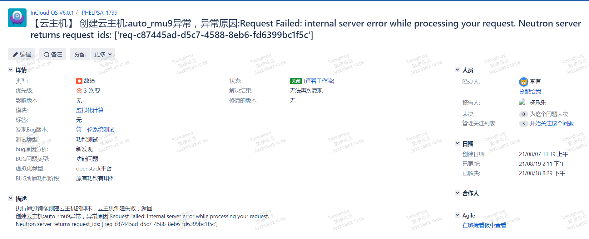

根本原因是，nova创建虚拟机需要调用neutron接口，neutron当时连接不上数据库，报错internal server error，所以最终cmp拿到的就是500 internal server error错误。

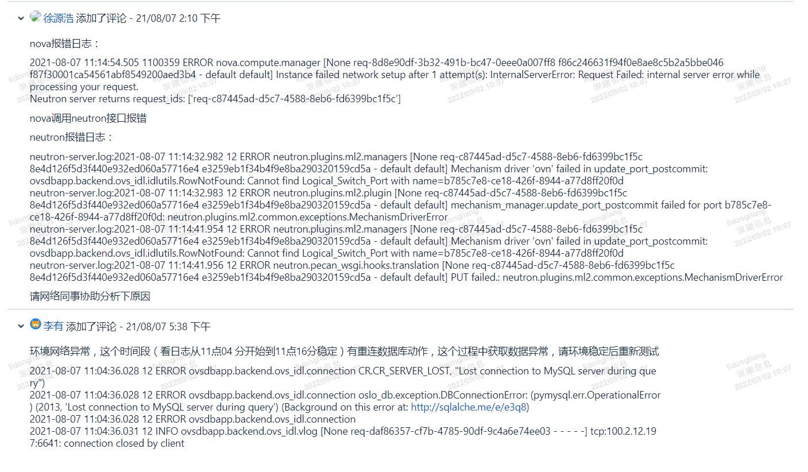

注：500不一定完全是服务端系统问题，也可能是业务问题。例如bug PHELPSA-1627，“保护中”状态的保护组，执行“开启保护”动作，状态码500，报错：“The operation was not performed because it is not valid given the current consistency group state”。


## 2. 503 Service Unavailable 服务不可用

可能原因是cmp后台可以连通icos，请求能够发到icos的ingress上，但是具体的服务无法访问。或者请求可以下发到具体服务，但是该服务依赖的其他服务存在故障。

例如bug：PHELPSG-551，cmp请求cinder创建云硬盘，创建失败，icos返回503。

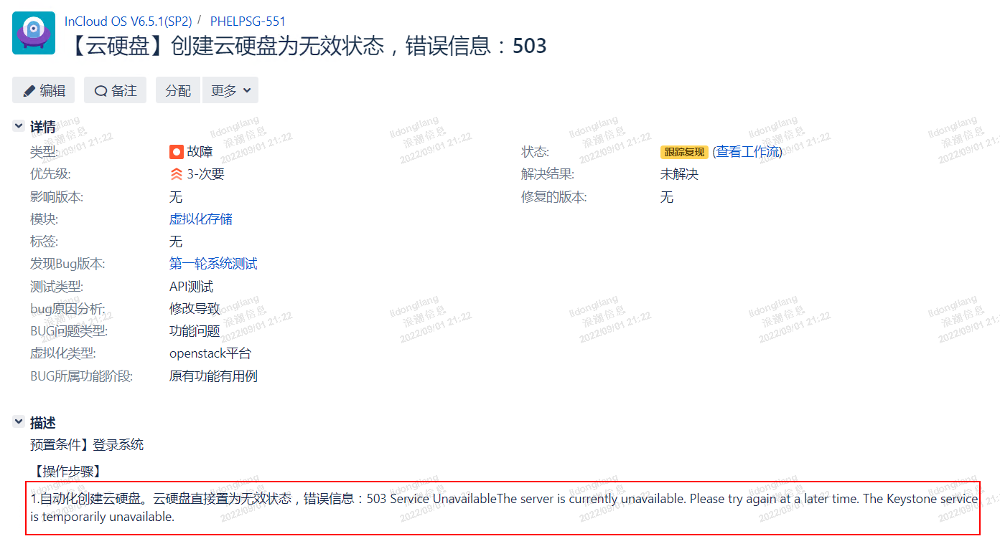

查看cinder日志，可以看到当时校验token时，keystone服务报错 500 Internal Server Error。

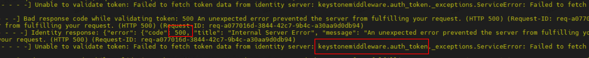


## 3. Connection reset 连接重置

服务端由于某种原因关闭了tcp连接，而此时客户端仍在读写数据，则客户端会收到服务端发送的rst包（连接复位）：

- 如果此时客户端正在从Socket的输出流中**读数据**，则报错“Connection reset”。

- 如果此时客户端正在从Socket的输入流中**写数据**，则报错“Connection reset by peer”。

例如bug PHELPS-1325，复制镜像失败。


CMP复制镜像的逻辑，是先从icos下载到cmp后台，再上传到另一个icos上。当前bug中，当上传到另一个icos上时，从日志报错中可以看到 connection reset 错误，上传失败，最终导致复制镜像失败。

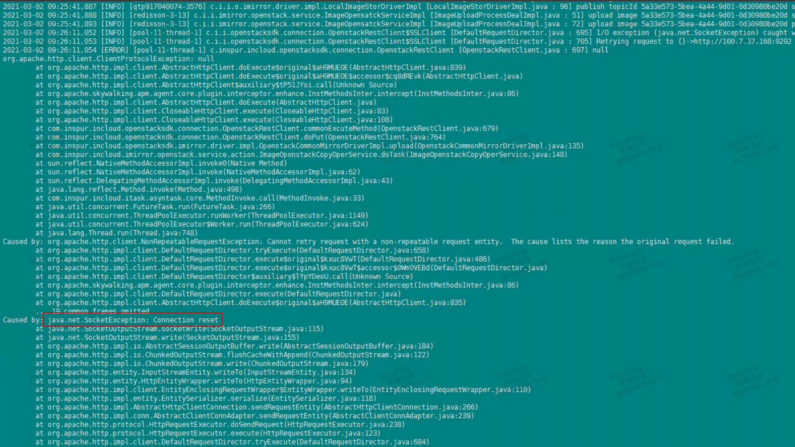


## 4. 接口连接超时

可能原因是icos挂掉、ingress服务停掉，或者网络问题（延迟、抖动或者丢包），会出现连接超时，报错“connect timed out”。

例如上海临港算力项目，删除对象存储，一直删除中，原因是网络连接异常，无法删除掉对象存储中的存储桶。

对象存储项目，使用的AmazonS3Client，它是有重试机制的。这个场景下，超过重试次数之后，网络仍然连接不上。AmazonS3Client连接超时，100s。响应超时，100s。


AmazonS3Client默认重试次数：3次。


调用OpenStack接口，最终都会调用OepnstackRestClient.getHttpClient()获取httpClient，在该方法中设置了连接超时时间：100s，响应超时：600s，使用的是DefaultHttpClient，没有重试机制。


## 5. 接口响应超时

例如bug PHELPSD-1793，创建云硬盘，调用icos接口响应超时，导致创建云硬盘失败。


cmp后台日志如下，调用cinder接口响应超时

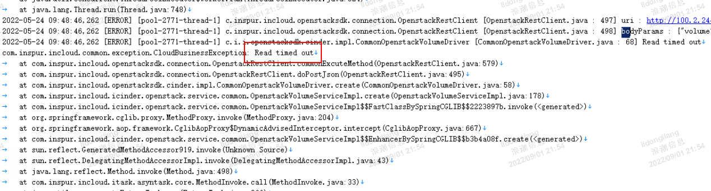

查看cinder日志，可以看到cinder连接数据库超时，进而导致cmp调用cinder响应超时。但实际上，经过cinder自身的重试，最终云硬盘在icos是创建成功了的。

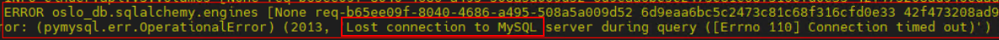


## 6. 场景汇总

|      |                   问题                   |                           场景举例                           |                        是否重试                        |
| :--: | :--------------------------------------: | :----------------------------------------------------------: | :----------------------------------------------------: |
|  1   | 500 Internal Server Error 服务器内部错误 | 例如bug：PHELPSA-1739，cmp调用nova创建虚拟机，nova调用neutron，neutron连不上数据库，最终cmp拿到500 Internal Server Error错误。 | 查询重试，创建、更新、删除根据具体icos接口是否幂等决定 |
|  2   |    503 Service Unavailable 服务不可用    | 例如bug：PHELPSG-551，cmp调用cinder创建云硬盘，cinder无法访问keystrone，最终cmp拿到503 Service Unavaliabe异常。 |                           是                           |
|  3   |        Connection reset 连接重置         | 例如bug：PHELPS-1325，当从cmp上传镜像到icos的过程中，服务端主动断开tcp连接，然后cmp报错 connection reset，最终导致复制镜像失败。 | 查询重试，创建、更新、删除根据具体icos接口是否幂等决定 |
|  4   |                 连接超时                 |  ingress服务停掉、icos挂掉，或网络问题（延迟、抖动或者丢包   |                           是                           |
|  5   |                 响应超时                 | 例如bug PHELPSD-1793，cmp调用cinder创建云硬盘，cinder连接数据库超时，最终cmp调用cinder接口响应超时。 | 查询重试，创建、更新、删除根据具体icos接口是否幂等决定 |


待讨论：

1. 请各位领导专家帮忙评审，以上重试场景决策是否合理。
2. 后期方案落地时，需要icos同事支持。例如指定接口是否幂等；例如需要依据错误信息进行重试的场景，需要帮忙提供代码中的错误信息原文。

# 二、重试组件 Spring Retry 

spring-retry是spring社区的一个成员，它提供了一种对失败操作进行自动重试的能力，可以作为某些瞬时错误（例如短暂的网络抖动）的解决方案。

作为spring生态的一部分，spring-retry自然地支持声明式（Declarative）方式使用。此外，它也支持命令式（Impertive）方式在代码里直接调用。

## 1. 项目集成

引入依赖：

```xml
<dependency>
    <groupId>org.springframework.retry</groupId>
    <artifactId>spring-retry</artifactId>
</dependency>
```

它的版本交给spring boot管理，以获得与spring良好的兼容性。

项目当前使用的是spring-boot版本为1.5.13.RELEASE，它管理的spring-retry版本是1.2.2.RELEASE。

## 2. 声明式使用方式

1. 在spring boot启动类上增加`@EnableRetry`注解：

   ```java
   @EnableRetry(proxyTargetClass = true)
   @SpringBootApplication
   public class TestApplication {
       public static void main(String[] args) {
           SpringApplication.run(TestApplication.class, args);
       }
   }
   ```

   该注解的proxyTargetClass属性默认为false，表示使用JDK的动态代理。如果设置为true，则表示使用CGLIB作为动态代理。

2. 在需要重试的方法上，增加`@Retryable`注解：

   ```java
   @Service
   @Slf4j
   public class RetryAnnotationTest {
   
       @Retryable(value = {RemoteAccessException.class}, maxAttempts = 5, backoff = @Backoff(delay = 1000L), recover = "recoverCall")
       public boolean call(String param){
           System.out.println(new Date());
           return RetryTask.retryTask(param);
       }
   
       @Recover
       public boolean recoverCall(Exception e,String param) {
           log.error("达到最大重试次数,或抛出了一个没有指定进行重试的异常:", e);
           return false;
    }
   }
   ```

   如上示例中，当call方法抛出`RemoteAccessException`异常时，spring retry会重新调用call方法，重试次数为5次，两次重试之间间隔为1s。

   如果超过最大重试次数仍未成功，或者抛出非`RemoteAccessException`异常，则调用recoverCall方法。

   注：@Retryable注解也可以作用在类上，作用在类上之后，spring retry会对类的全部方法进行重试。


## 3. 命令式使用方式

1. 配置RetryTemplate：

   ```java
   @Configuration
   public class SpringRetryConfig {
      
       @Bean("retryTemplateFixed")
       public RetryTemplate retryTemplateFixed() {
           // 1.重试策略
           // 触发条件
           Map<Class<? extends Throwable>, Boolean> exceptionMap = new HashMap<>();
           exceptionMap.put(RemoteAccessException.class, true);
           
           // 重试次数设置为3次
           int maxAttempts = 3;
           SimpleRetryPolicy retryPolicy = new SimpleRetryPolicy(maxAttempts, exceptionMap);
   
           // 2.重试间隔设置为1秒
           FixedBackOffPolicy backOffPolicy = new FixedBackOffPolicy();
           backOffPolicy.setBackOffPeriod(1000);
   
           // 3.构造RetryTemplate
           RetryTemplate retryTemplate = new RetryTemplate();
           retryTemplate.setRetryPolicy(retryPolicy);
           retryTemplate.setBackOffPolicy(backOffPolicy);
           return retryTemplate;
       }
       
       @Bean("retryTemplate")
       public RetryTemplate retryTemplate() {
           // 定义简易重试策略，最大重试次数为3次,重试间隔为3s
           return RetryTemplate.builder()
                   .maxAttempts(3)
                   .fixedBackoff(3000)
                   .retryOn(RuntimeException.class)
                   .build();
       }
       
   }
   ```

   注：可以配置多个RetryTemplate，用以适应不同重试场景。

   

   spring retry支持的重试策略和退避策略如下：

   ```java
   @Bean("retryTemplateDemo")
   public RetryTemplate retryTemplateDemo() {
       // 1.重试策略
       // 不重试
       NeverRetryPolicy neverRetryPolicy = new NeverRetryPolicy();
   
       // 无限重试
       AlwaysRetryPolicy alwaysRetryPolicy = new AlwaysRetryPolicy();
   
       // 设置不同异常的重试策略，类似组合重试策略，区别在于这里只区分不同异常的重试
       ExceptionClassifierRetryPolicy exceptionClassifierRetryPolicy = new ExceptionClassifierRetryPolicy();
       final Map<Class<? extends Throwable>, RetryPolicy> policyMap = new HashMap<>(3);
       policyMap.put(IOException.class, alwaysRetryPolicy);
       policyMap.put(InterruptedIOException.class, neverRetryPolicy);
       policyMap.put(UnknownHostException.class, neverRetryPolicy);
       exceptionClassifierRetryPolicy.setPolicyMap(policyMap);
   
       // 固定次数重试，默认最大重试次数为5次，RetryTemplate默认重试策略
       SimpleRetryPolicy simpleRetryPolicy = new SimpleRetryPolicy();
       simpleRetryPolicy.setMaxAttempts(5);
   
       // 超时时间重试，默认超时时间为1秒，在指定的超时时间内重试
       TimeoutRetryPolicy timeoutRetryPolicy = new TimeoutRetryPolicy();
       timeoutRetryPolicy.setTimeout(3000);
   
       /*
        * 组合重试策略，有两种组合方式：
        *  1.悲观默认重试，有不重试的策略则不重试。
        *  2.乐观默认不重试，有需要重试的策略则重试。
        */
       CompositeRetryPolicy compositeRetryPolicy = new CompositeRetryPolicy();
       compositeRetryPolicy.setOptimistic(true);
       compositeRetryPolicy.setPolicies(new RetryPolicy[]{simpleRetryPolicy, timeoutRetryPolicy});
   
       // 有熔断功能的重试
       CircuitBreakerRetryPolicy circuitBreakerRetryPolicy = new CircuitBreakerRetryPolicy(compositeRetryPolicy);
       // 5s内失败10次，则开启熔断
       circuitBreakerRetryPolicy.setOpenTimeout(5000);
       // 10s之后熔断恢复
       circuitBreakerRetryPolicy.setResetTimeout(10000);
   
       // 2.退避策略（上一次执行失败之后，间隔多久进行下一次重试）
       // 立即重试
       NoBackOffPolicy noBackOffPolicy = new NoBackOffPolicy();
   
       // 固定时间后重试，默认1s
       FixedBackOffPolicy fixedBackOffPolicy = new FixedBackOffPolicy();
       fixedBackOffPolicy.setBackOffPeriod(1000);
   
       // 随机时间后重试（如下：从500ms到1500ms内取一个随机时间后进行重试）
       UniformRandomBackOffPolicy uniformRandomBackOffPolicy = new UniformRandomBackOffPolicy();
       uniformRandomBackOffPolicy.setMinBackOffPeriod(500);
       uniformRandomBackOffPolicy.setMaxBackOffPeriod(1500);
   
       // 指数退避策略（如下：初始休眠时间100ms，最大休眠时间30s，下一次休眠时间为当前休眠时间*2）
       ExponentialBackOffPolicy exponentialBackOffPolicy = new ExponentialBackOffPolicy();
       exponentialBackOffPolicy.setInitialInterval(100);
       exponentialBackOffPolicy.setMaxInterval(30000);
       exponentialBackOffPolicy.setMultiplier(2);
   
       // 随机指数退避策略
       ExponentialRandomBackOffPolicy exponentialRandomBackOffPolicy = new ExponentialRandomBackOffPolicy();
       exponentialRandomBackOffPolicy.setInitialInterval(100);
       exponentialRandomBackOffPolicy.setMaxInterval(30000);
       exponentialRandomBackOffPolicy.setMultiplier(2);
   
       // 3.return
       RetryTemplate retryTemplate = new RetryTemplate();
       retryTemplate.setRetryPolicy(circuitBreakerRetryPolicy);
       return retryTemplate;
   }
   ```

   

2. 在代码中调用

   ```java
   @Slf4j
   @RunWith(SpringRunner.class)
   @SpringBootTest
   public class RetryTest {
   
       // 注入RetryTemplate
       @Resource
       private RetryTemplate retryTemplateFixed;
   
       @Test
       public void test() {
           // 执行
           Boolean execute = retryTemplateFixed.execute(
                   // 重试回调
                   retryContext -> {
                       System.out.println(new Date());
                       boolean b = RetryTask.retryTask("abc");
                       log.info("调用的结果:{}", b);
                       return b;
                   },
                   // 恢复回调（达到最大重试次数，或者抛出不满足重试条件的异常）
                   retryContext -> {
                       log.info("已达到最大重试次数或抛出了不重试的异常~~~");
                       return false;
                   }
           );
   
           log.info("执行结果:{}",execute);
   
       }
   
   }
   ```


3. 监听重试过程

   通过实现RetryListener接口，重写open、close、onError这三个方法，既可以完成对重试过程的追踪，也可以添加额外的处理逻辑。

   ```java
   @Slf4j
   @Component
   public class RetryListenerTemplate implements RetryListener {
       // 进入重试前调用
       @Override
       public <T, E extends Throwable> boolean open(RetryContext retryContext, RetryCallback<T, E> retryCallback) {
           log.info("--------------------------进入重试方法--------------------------");
       return true;
       }
   
       // 重试结束后调用
       @Override
       public <T, E extends Throwable> void close(RetryContext retryContext, RetryCallback<T, E> retryCallback, Throwable throwable) {
       log.info("--------------------------重试方法结束--------------------------");
       }
   
       // 捕获到异常时调用
       @Override
       public <T, E extends Throwable> void onError(RetryContext retryContext, RetryCallback<T, E> retryCallback, Throwable throwable) {
           log.info("--------------------------第" + retryContext.getRetryCount() + "次重试--------------------------");
           log.error(throwable.getMessage(), throwable);
   }
   }
   ```

   

   或者，通过继承RetryListenerSupport，也可以从open、close、onError这三个方法中，选择性的重写。

   ```java
   public class RetryListener4Open extends RetryListenerSupport {
       @Override
       public <T, E extends Throwable> boolean open(RetryContext context, RetryCallback<T, E> callback) {
           return super.open(context, callback);
       }
   }
   ```

   

   在实例化RetryTemplate时，配置上该RetryListener实例即可。

   ```java
   retryTemplate.setListeners(new RetryListener[] {retryListenerTemplate});
   ```

   

   注：

   1. V2.0版本以后，新增一个doOnSuccess方法，可以在调用成功之后，根据返回的结果值，来决定是否要进行重试。
   2. 每个RetryTemplate可以注册多个监听器，其中onOpen、onClose方法按照注册顺序执行，onError按照注册顺序的相反顺序执行。


参考资料：

1. [Spring-Retry 和 Guava-Retry](https://www.toutiao.com/article/7135258770565136937/?app=news_article&timestamp=1661330198&use_new_style=1&req_id=202208241636370101511430471214A95B&group_id=7135258770565136937&share_token=4A0A0975-A83B-4D73-B5F6-F0449C0AB1D2&tt_from=weixin&utm_source=weixin&utm_medium=toutiao_ios&utm_campaign=client_share&wxshare_count=1&source=m_redirect&wid=1661396640934)
2. [Spring Retry Github地址](https://github.com/spring-projects/spring-retry)

# 三、落地方案

## 1. 公共位置自动重试

cmp对于icos接口的调用，最终会通过incloudmanager-openstack-sdk项目的OpenstackRestClient或其子类，转换为Http请求。

因此，可在公共位置统一处理的问题，无需侵入各服务的业务代码，而仅需在这些类的doGet、doPost等方法上增加重试机制即可。

在当前方案中，如下场景会在公共位置自动重试：

|      |                   场景                   |        重试方法        |
| :--: | :--------------------------------------: | :--------------------: |
|  1   | 500 Internal Server Error 服务器内部错误 |          查询          |
|  2   |    503 Service Unavailable 服务不可用    | 查询、创建、更新、删除 |
|  3   |        Connection reset 连接重置         |          查询          |
|  4   |                 连接超时                 | 查询、创建、更新、删除 |
|  5   |                 响应超时                 |          查询          |

下面以GET请求连接超时场景为例，阐述Spring Retry在项目中公共位置自动重试的落地方案：

1. 创建CloudRetryPublicException异常类，作为公共位置重试标识。

   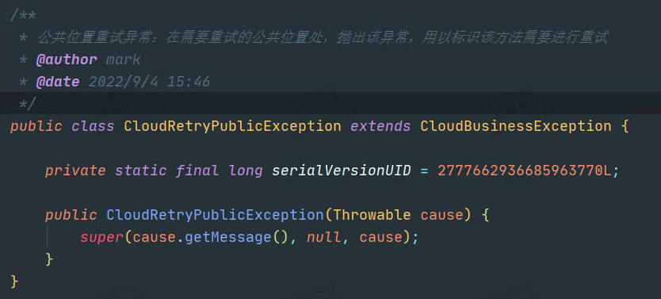

   

2. 配置重试监听器，监听重试过程。

   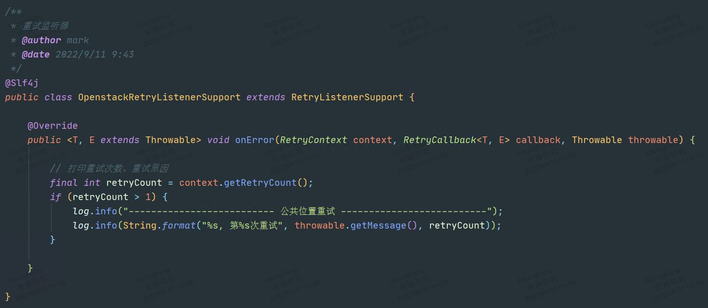

   

3. 创建Spring Retry配置类。

   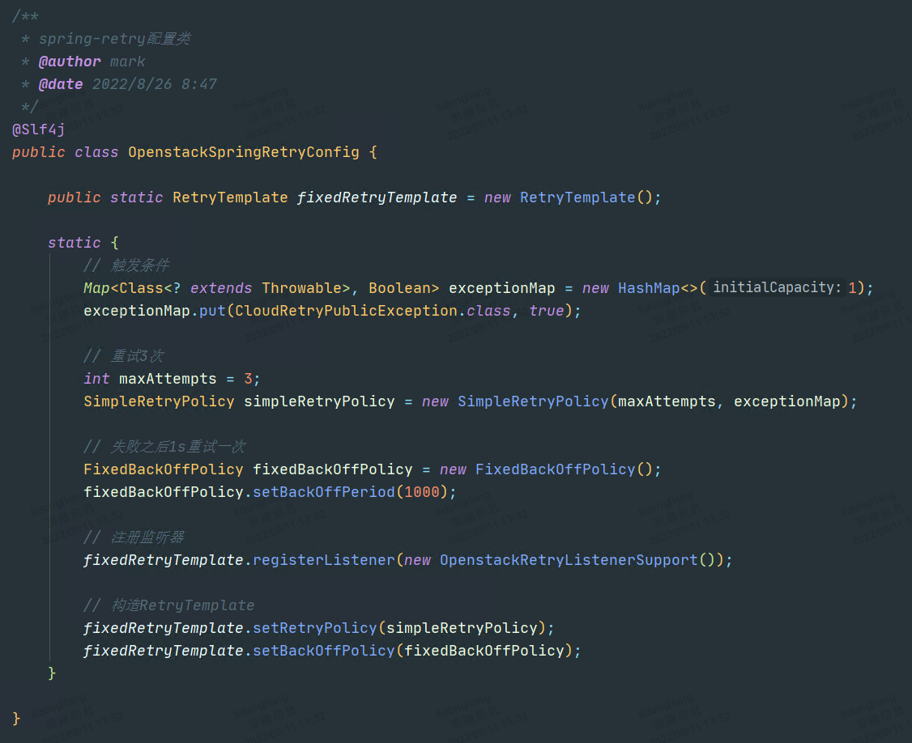

   

4. 定义包含重试机制的doGetRetry方法。 

   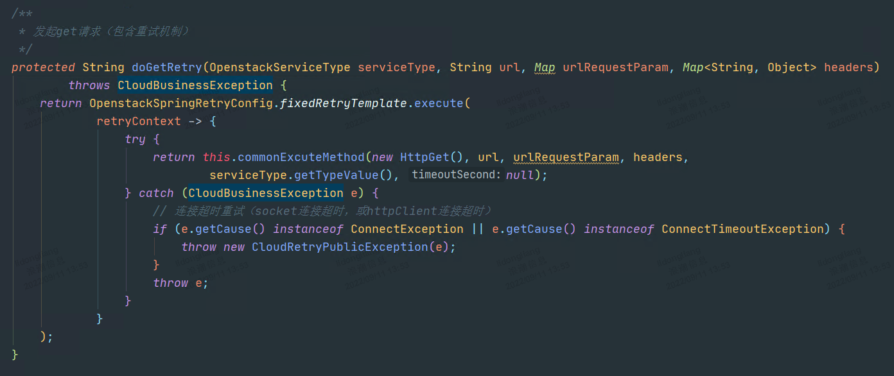

   

5. 重构doGet方法，调用doGetRetry。

   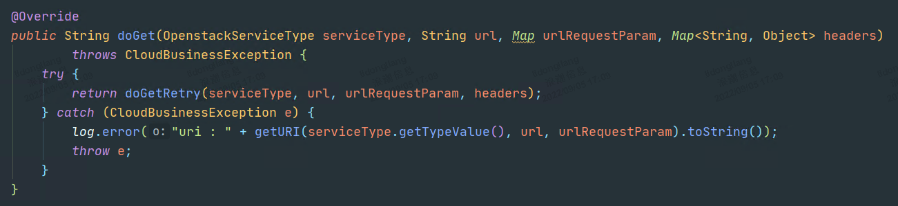

   

6. 当cmp连接icos失败，按照配置，最终重试三次。

   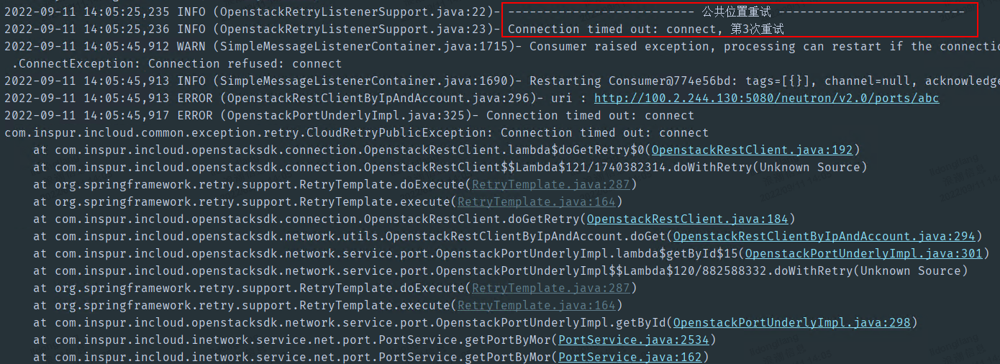


## 2. 公共位置手动重试

针对可在公共位置处理，但并非全部业务无差别重试的问题。本方案提供出公共重试方法，供各模块针对自身业务场景，以及对应的icos接口幂等性选择性调用。

在当前方案中，如下场景可在公共位置手动重试：

|      |                   场景                   |     重试方法     |
| :--: | :--------------------------------------: | :--------------: |
|  1   | 500 Internal Server Error 服务器内部错误 | 创建、更新、删除 |
|  2   |        Connection reset 连接重置         | 创建、更新、删除 |
|  3   |                 响应超时                 | 创建、更新、删除 |

下面以更新port为例，阐述Spring Retry在项目中公共位置手动重试的落地方案：

1. 异常类、监听器、Spring Retry配置类，同上一章节。

2. 在OpenstackRestClient类中，定义包含重试机制的doPutRetry方法。

   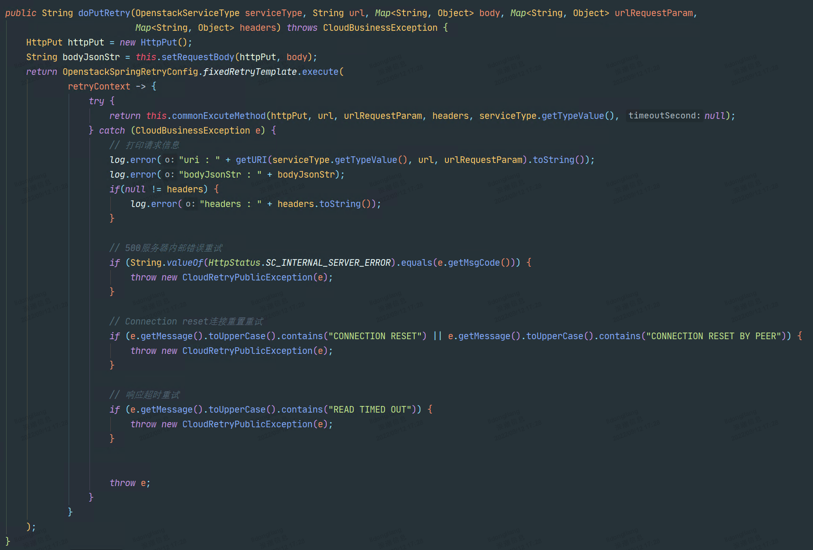

3. 在更新port方法中，初始化penstackRetryRestClientByIpAndAccount实例。

   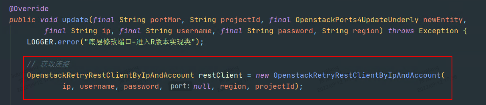

4. doPut方法替换为doPutRetry方法。

   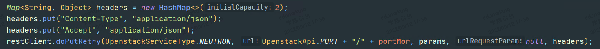

5. 改造之后，更新port方法，会针对500服务器内部错误、Connection reset 连接重置，响应超时这三种场景进行重试。


## 3. 特定场景手动重试

在上一章节定义的公共重试方法中，会对全部需要重试的场景进行重试。

但是，有时候我们仅需针对某个场景，或者某几个场景的组合来进行重试。而不同场景的组合，如果都在公共方法中实现，会因为重试场景的扩充成指数级增长。

此外，也可能需要根据异常信息内容，判断是否要进行重试。因为这种问题和业务耦合性非常高，所以也不适合在公共位置进行重试。

以[503 Service Unavailable 服务不可用](#2. 503 Service Unavailable 服务不可用)章节为例。因创建云硬盘icos接口非幂等，且响应超时或connection reset导致的失败，客户端无法确定服务端是否已开始执行，所以不应进行重试。但如果是因为keystone服务不可用，导致cinder返回503，则可以进行重试。

针对以上问题，本方案提供了一种针对特殊场景手动重试的方法。下面以创建云硬盘为例：

1. 创建CloudRetrySpecificException异常类，作为特定位置重试标识。

   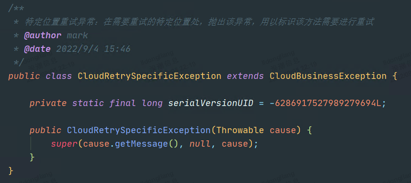

   

2. 配置重试监听器，监听重试过程。

   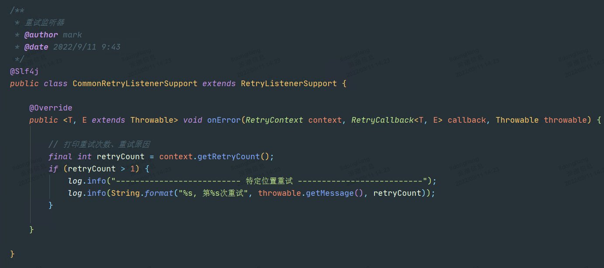

   

3. 在incloudmanager-common项目中，创建Spring Retry配置类，**各模块无需单独配置**。

   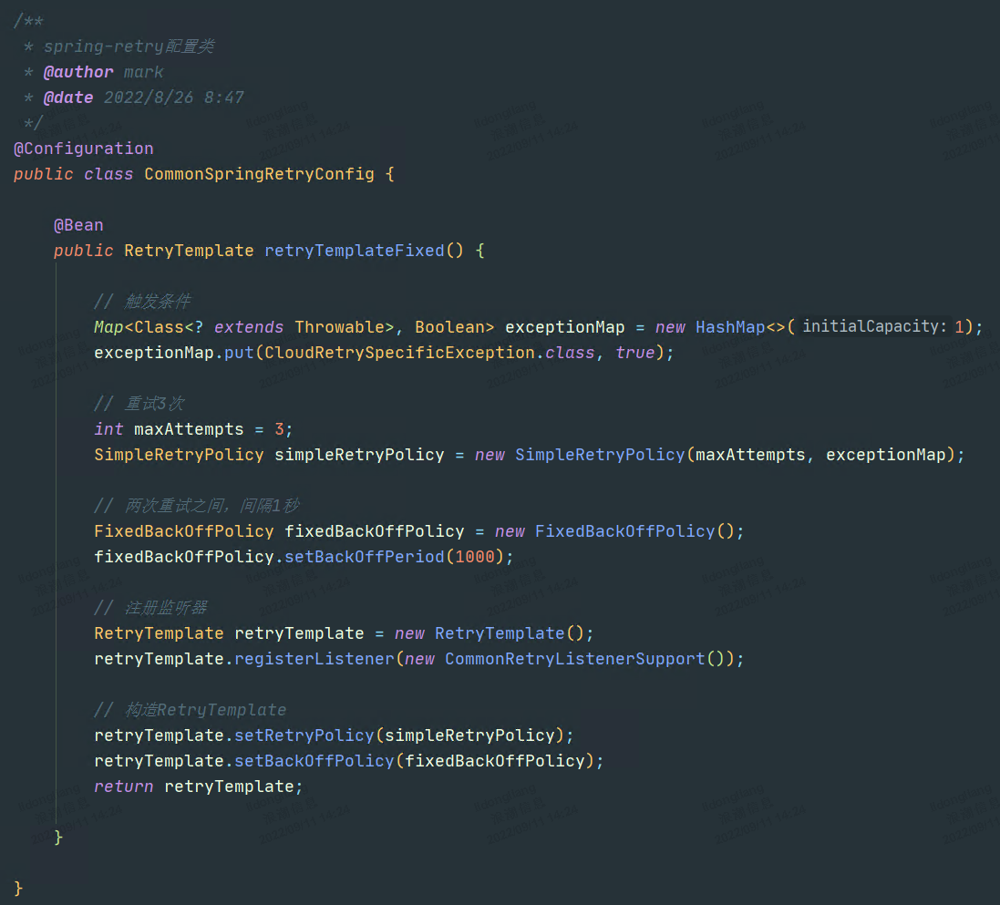

   

4. 利用步骤3创建的配置类，为创建云硬盘增加重试机制，在捕获503异常且异常信息包含特定内容时发起重试。

   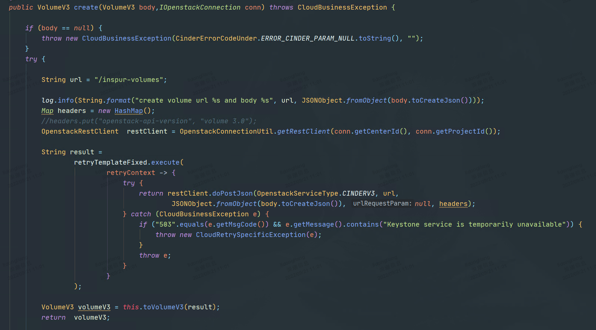

   

   注意：

   ​	在公共位置已经做过重试的场景，不要再在特定位置进行重试，因为这会产生链路放大效应。

   ​	举例来说，假设在公共位置处，已经对连接超时进行了3次重试；如果在特定位置处，也对连接超时进行3次重试，则最终会产生 3 * 3 = 9 次重试。

# 四、落地计划

1. 公共位置自动重试，代码实现，**1130完成**。
2. 公共位置手动重试，提供出公共重试方法，包含doPostRetry、doDeleteRetry、doPutRetry、doGetRetry，**1130完成**。
3. 特定场景手动重试，提供出适应不同场景的spring-retry配置类。**1130完成**。具体调用处，需持续实现。