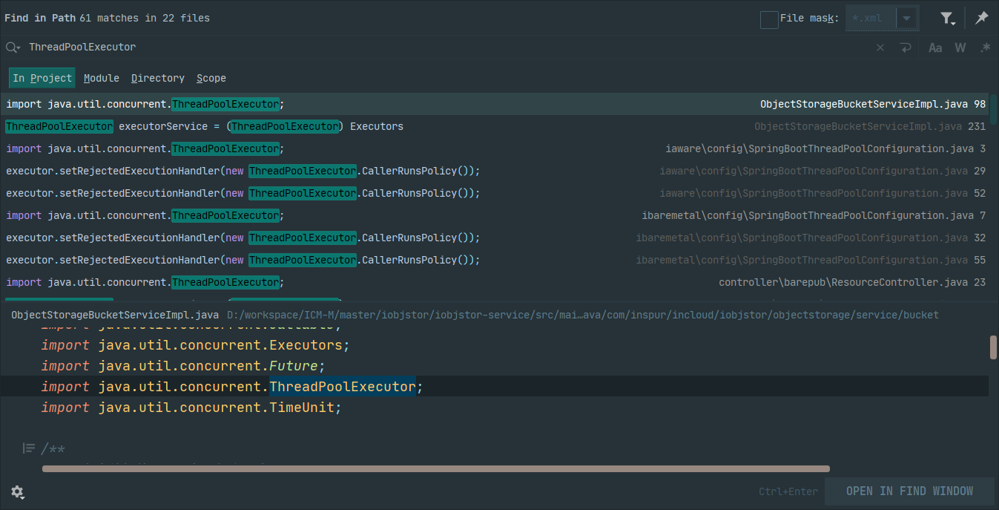
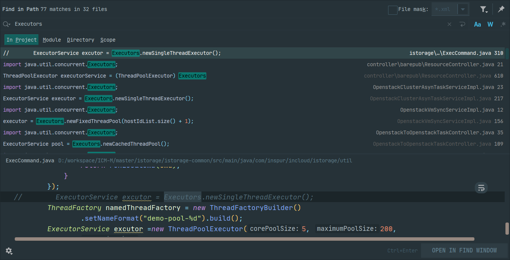
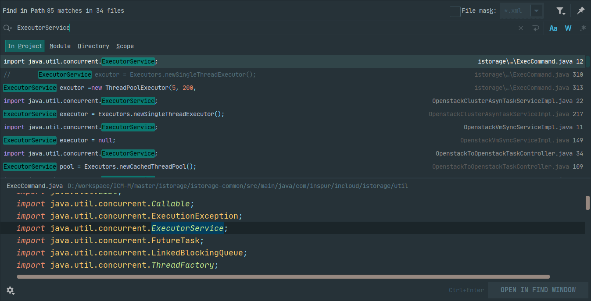
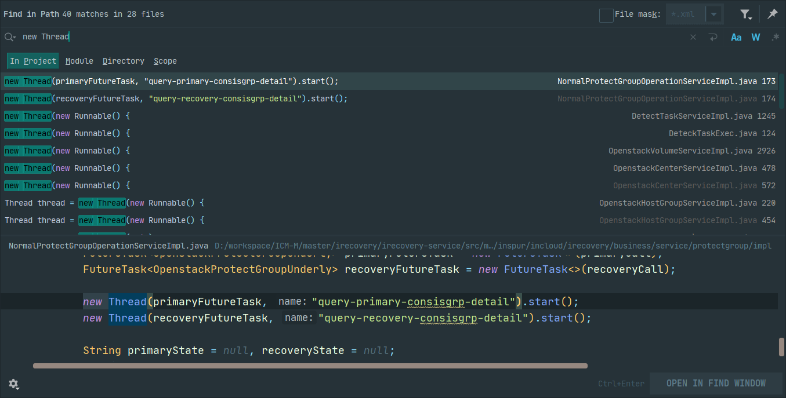
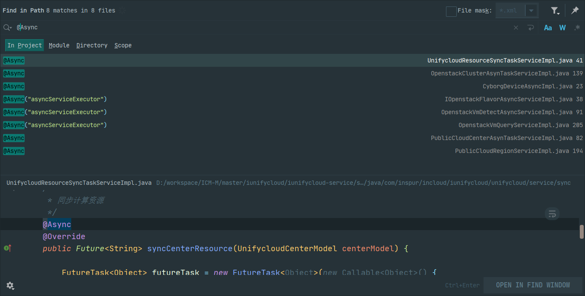

[toc]

# 一、问题描述

项目中存在自建线程池，和手动创建线程代码。频繁的创建、销毁线程和线程池，会给系统带来额外的开销。未经池化及统一管理的线程，则会导致**系统内线程数上限不可控**。

例如如下代码，每次发送邮件都会创建一个新的线程池，并且业务结束之后线程池也未随之销毁。

```java
public static boolean sendHtmlMail(MailInfo mailInfo, MailServerInfo mailServerInfo) {
    try {
        ExecutorService executorService = Executors.newCachedThreadPool();
        Future<Boolean> future = executorService.submit(() -> {
            try {
                return asyncSendEmail(mailInfo, mailServerInfo);
            } catch (Exception e) {
                return false;
            }
        });
        return future.get(10, TimeUnit.SECONDS);
    } catch (Exception e) {
        LOG.error(e.getMessage(), e);
        return false;
    }
}
```

这种情况下，随着访问数增加，系统内线程数持续增长，CPU负载逐步提高。极端情况下，甚至可能会导致CPU资源被吃满，整个服务不可用。

项目上曾遇到过两次微服务无法正常访问。当时定位到的原因，就是该微服务存在自建`FixedThreadPool`线程池并且未正确销毁，故障发生时同时存活线程数量超过一万个。

为了解决上述问题，我们计划为各微服务增加统一线程池配置，替换掉自建线程和线程池。

# 二、识别系统内自建线程、线程池

## 2.1. 线程池

### 2.1.1. 自建线程池的方式

1. 使用ThreadPoolExecutor手动创建线程池。

   ```java
   ThreadPoolExecutor threadPoolExecutor = new ThreadPoolExecutor(20, 100, 60, TimeUnit.SECONDS, new LinkedBlockingQueue<>());
   ```

2. 使用线程池工厂类Executors，调用newFixedThreadPool、newSingleThreadExecutor等方法创建线程池。

   ```java
   ExecutorService executorService = Executors.newFixedThreadPool(10);
   ```

### 2.1.2. 自建线程池的识别

答：搜索关键字：ThreadPoolExecutor、Executors、ExecutorService。

### 2.1.3. 系统内自建线程池统计

ThreadPoolExecutor：61次匹配，分布于22个文件中。



Executors：77次匹配，分布于32个文件中。



ExecutorService：85次匹配，分布于34个文件中。



*注：以上只是一个粗略的统计，其中存在重复统计的情况，细粒度的统计需要进一步分析。*

## 2.2. 线程

### 2.2.1. 自建线程的方式

1. 继承Thread类，实现run方法。

   ```java
   public class Test {
       public static void main(String[] args) {
           new MyThread().start();
       }
   }
   
   class MyThread extends Thread {
       @Override
       public void run() {
           // 业务逻辑
       }
   }
   ```

2. new一个Thread类，传入Runnable实例。

   ```java
   public static void main(String[] args) {
       new Thread(new Runnable() {
           @Override
           public void run() {
   			// 业务逻辑
           }
       }).start();
   }
   ```

3. new一个Thread类，传入FutureTask实例，可通过get方法获取返回值。

   ```java
   public static void main(String[] args) throws Exception {
       FutureTask<Object> futureTask = new FutureTask<>(new Callable<Object>() {
           @Override
           public Object call() throws Exception {
               // 业务逻辑
               return null;
           }
       });
       Thread thread = new Thread(futureTask);
       thread.start();
       Object result = futureTask.get();
   }
   ```

### 2.2.2. 自建线程的识别

答：搜索关键字"new Thread"、"Thread"。

### 2.2.3. 系统内自建线程统计

new Thread：40次匹配，分布于28个文件中。



## 2.3. Async注解

### 2.3.1. Async概述

将`Spring`的`@Async`注解应用于方法上，可将该方法变为一个异步方法。该注解默认使用`Spring` 的`SimpleAsyncTaskExecutor` 线程池，但它并不是一个真正的线程池，**每次方法调用，都会创建一个新线程，因此不推荐直接使用**。

如果一定要使用，可在注解中指定自定义线程池，示例代码如下：

```java
@Async("asyncServiceExecutor")
public Future<List<OpenstackFlavorInfo4Get>> getExchangeDatas() {
    // 业务逻辑
}
```

### 2.3.2. 系统内Async注解统计

Async：5个方法使用了@Async默认线程池。



# 三、线程池配置推荐

本文档基于Spring框架提供的线程池，提供两种线程池配置方案，详细介绍如下。

## 3.1. 常用线程池

该线程池核心线程20，缓存队列60，最大线程100。

核心线程满载之后，新任务会先放到缓存队列中。适用于触发频率高、耗时短的任务。因为这种任务会迅速释放掉核心线程，然后继续消化缓存队列中的任务。这样既能保证队列中任务不会等太久，也降低了频繁创建销毁线程的资源开销。

```java
/**
 * SpringBoot线程池配置类
 */
@Configuration
public class SpringBootThreadPoolConfiguration {

    /**
     * 常用线程池：用以执行触发频率高、耗时短的任务
     */
    @Bean("commonTaskExecutor")
    public ThreadPoolTaskExecutor commonTaskExecutor() {
        ThreadPoolTaskExecutor executor = new ThreadPoolTaskExecutor();
        // 核心线程：核心线程一直存活
        executor.setCorePoolSize(30);
        // 队列容量：任务将队列塞满之后，扩展核心线程，线程总数最多不超过最大线程数
        executor.setQueueCapacity(60);
        // 最大线程
        executor.setMaxPoolSize(100);
        // 闲置线程存活时长
        executor.setKeepAliveSeconds(60);
        // 拒绝策略：任务超出线程池容量后，新任务交还主线程处理
        executor.setRejectedExecutionHandler(new ThreadPoolExecutor.CallerRunsPolicy());
        // 线程名前缀
        executor.setThreadNamePrefix("common-task-worker-");
        // 初始化线程池
        executor.initialize();
        return executor;
    } 
}
```


## 3.2. 长耗时线程池

对于耗时长的任务，如果使用常用线程池处理，会存在耗时长任务逐渐打满线程池负载，而触发频率高、耗时短的任务没有空闲线程可用的可能性。因此有必要单独为耗时长的任务配置一个线程池。

该线程池核心线程20，**缓存队列0**，最大线程100。

核心线程满载之后，会立即开启新线程。适用于触发频率低、耗时长的任务。因为这类任务占用单个线程时间长，缓存队列为0，有利于缩短任务平均执行时间。

```java
/**
 * SpringBoot线程池配置类
 */
@Configuration
public class SpringBootThreadPoolConfiguration {   
    /**
     * 高负载线程池：用以执行出发频率低、耗时长任务
     */
    @Bean("expensiveTaskExecutor")
    public ThreadPoolTaskExecutor expensiveTaskExecutor() {
        ThreadPoolTaskExecutor executor = new ThreadPoolTaskExecutor();
        // 核心线程：核心线程一直存活
        executor.setCorePoolSize(20);
        // 队列容量：任务将队列塞满之后，扩展核心线程，线程总数最多不超过最大线程数
        executor.setQueueCapacity(0);
        // 最大线程
        executor.setMaxPoolSize(100);
        // 闲置线程存活时长
        executor.setKeepAliveSeconds(60);
        // 拒绝策略：任务超出线程池容量后，新任务交还主线程处理
        executor.setRejectedExecutionHandler(new ThreadPoolExecutor.CallerRunsPolicy());
        // 线程名前缀
        executor.setThreadNamePrefix("expensive-task-worker-");
        // 初始化线程池
        executor.initialize();
        return executor;
    }
}
```

注：以上两个线程池配置，是基于网络模块自身业务特征，在实践中总结出来的，并不完全适用于其他模块，请根据各自模块业务特征进行微调。

# 四、FAQ

## 4.1. `Spring`的线程池`ThreadPoolTaskExecutor`，和`JDK`自带线程池`ThreadPoolExecutor`的区别是什么？

答：`ThreadPoolTaskExecutor`在`ThreadPoolExecutor`的基础上进行了一层封装，增加了`submitListenable`方法。

而`submitListenable`方法返回的`ListenableFuture`接口对象，可以用来添加线程执行完毕后成功和失败的回调方法。

与`Future.get()`方法相比，通过回调的方式，不会阻塞主线程，线程执行结果或抛出的异常通过回调函数异步处理。

示例代码如下：

```java
final ListenableFuture<String> listenableFuture = threadPoolTaskExecutor
    .submitListenable(() -> {
    	TimeUnit.SECONDS.sleep(2);
    	return "result";
	});
listenableFuture.addCallback(data -> log.info(data), e -> log.error(e.getMessage(), e));
```


## 4.2. 客户现场是否有办法动态调整线程池配置？

答：可以将线程池的三个核心参数`corePoolSize`、`queueCapacity`、`maxPoolSize`，配置到`configmap`中，模块内线程池从`configmap`中取这个配置。

但是，这个方案存在缺点。首先，各模块需要维护自己的线程池参数，新增配置较多。此外，如果在开发过程中进行调整，也需要LMT同步修改部署脚本。