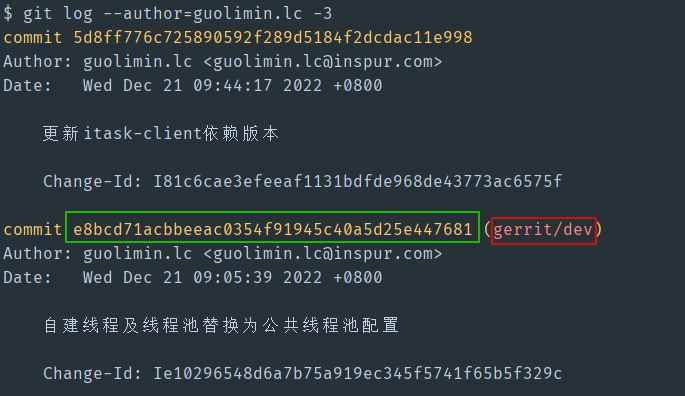

# 一、新分支开发模型简述

两条核心分支 **develop**、**master**

- 迭代开发期间：代码提交到**develop**分支。

- 进入系统测试：**develop**分支`merge`到**master**分支。

- 系统测试期间：**develop**分支修复bug，自测确认没有问题后，`cherry-pick`到**master**分支。如果`cherry-pick`产生冲突，需要在**develop**分支解决后重新合入master。

  

# 二、代码提交规范

代码提交commit信息请遵循如下信息：

1. 需求开发：**feature#** + 需求编号 + 空格 + 需求名称
2. Bug修复：**bugfix#** + Bug号 + 空格 + Bug描述
3. 其他：**change#** + 版本号 + 空格 + 关键描述

review代码到develop分支时，需要分支名，请使用命令：`git review develop`

# 三、cherry-pick命令使用示例

`cherry-pick`命令用来将一个分支的指定`commit`合并到另一个分支上，下面以将dev分支的一个commit合并到develop分支举例：

1. 获取**dev分支**commit的`commit id`

   

2. 在**develop分支**使用命令`git cherry-pick "commit id"`合并代码

   

3. 解决冲突

   如果产生冲突，git会进入`CHRRY-PICKING`状态，如下图所示

   

   

   这时我们使用`git status`命令可以查看到如下信息

   

   **其中红色的文件就是冲突文件，需要开发人员手动解决**

   

   冲突解决完毕后，使用命令 `git add` 命令通知`git`冲突已经解决

   

   

   然后再使用命令`git cherry-pick --continue`完成代码合并

   

   

   最后使用命令`git review develop`提交该commit到develop分支即可

参考资料：

1. [git cherry-pick 教程](https://www.ruanyifeng.com/blog/2020/04/git-cherry-pick.html)