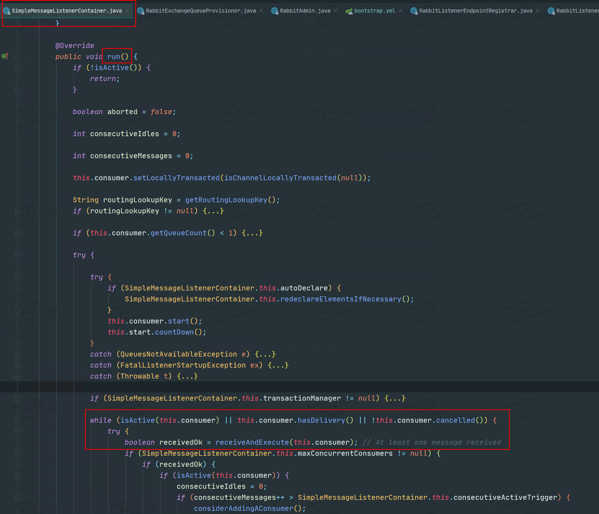
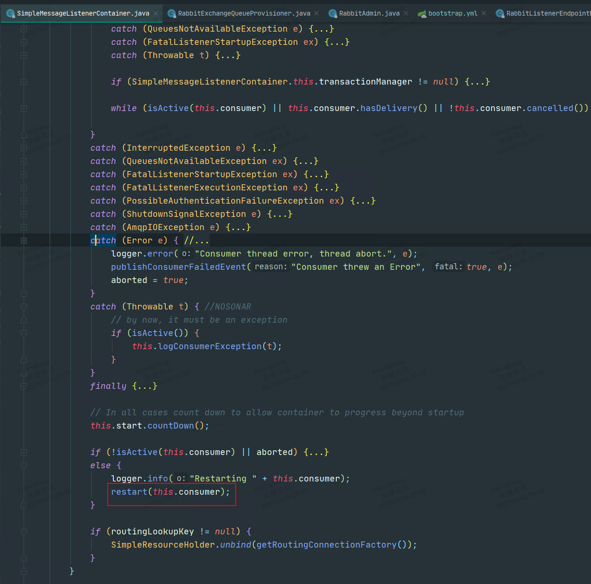
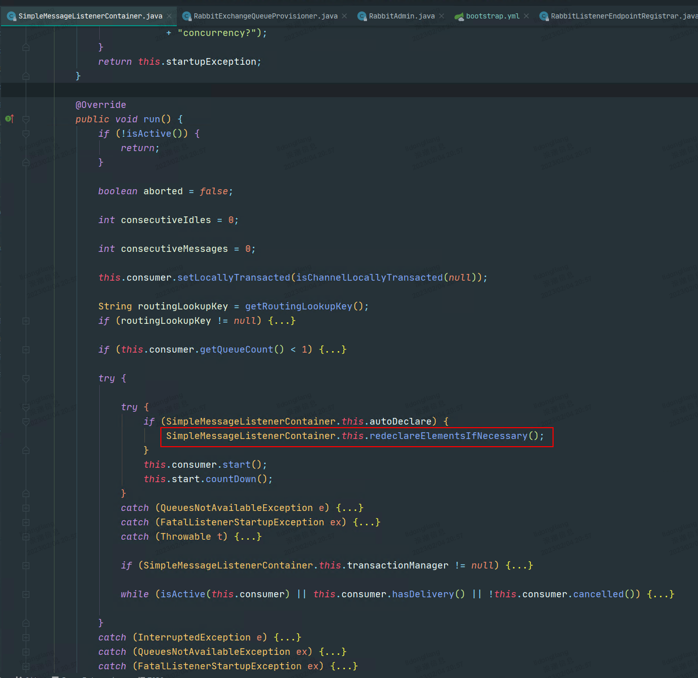
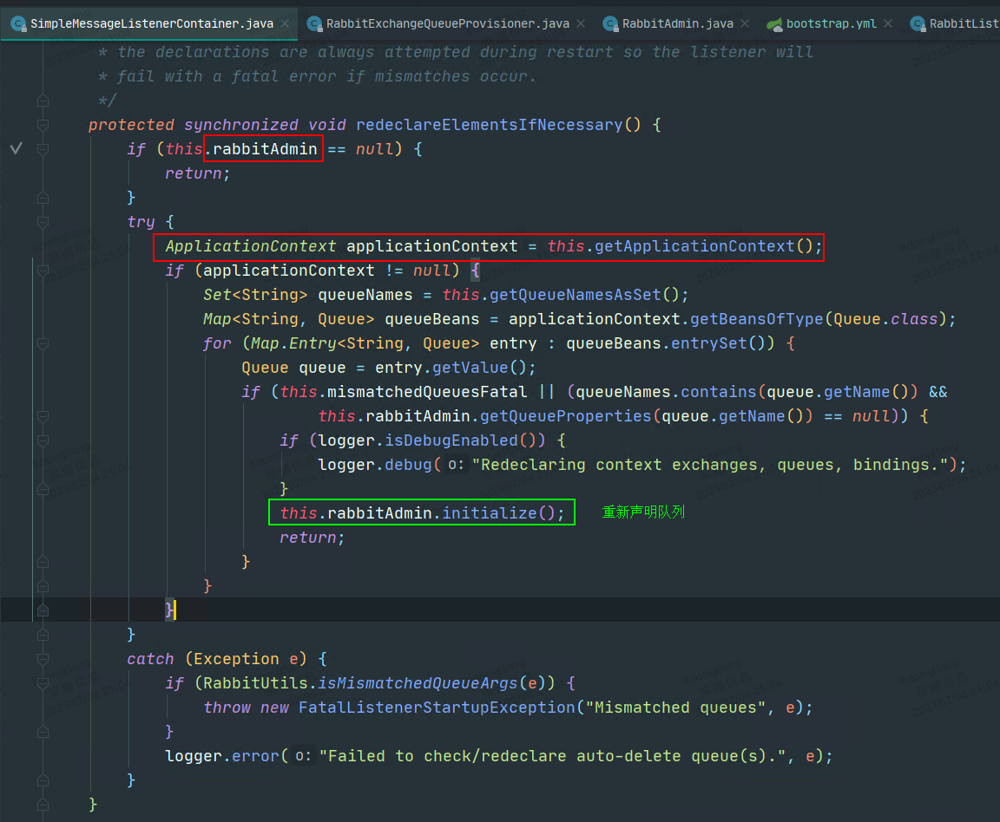
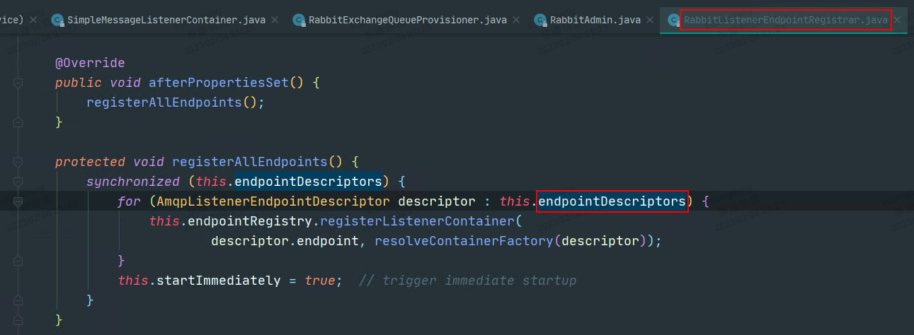
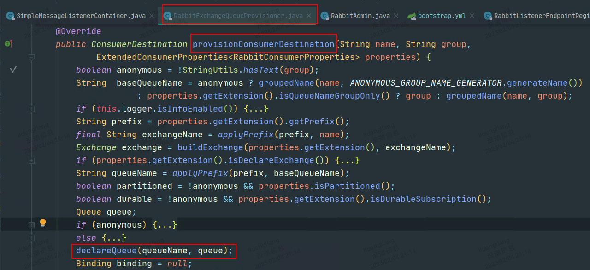

> 队列被删除后，使用Spring Cloud Stream的客户端，是否可以自动重新声明该队列？

1. 无论是基于Spring Boot还是Spring Cloud Stream集成RabbitMQ的项目，启动后，SimpleMessageListenerContainer（SMLC）的run()方法的while循环，会始终处于运行状态，用来执行从broker中获取消息并存入本地队列等操作。

   

   

2. 当队列被删除后，while循环内代码抛出异常，while循环中断，并执行restart方法

   

   

3. restart方法会重新进入run方法，并尝试重新声明队列

   

   

   但是，只有rabbitAdmin和applicationContext被初始化过，队列才可以被重新声明。

   

   

4. 当项目是使用SpringBoot集成RabbitMQ时，使用的是spring-rabbit的方式声明的队列，如下图所示，endpointDescriptors列表有值，然后经过一些列的调用，rabbitAdmin和applicationContext会被初始化。所以，队列被删除后，可以重新声明队列。

   

   

   而当项目是使用Spring Cloud Stream集成RabbitMQ时，使用的是spring-cloud-stream的方式声明的队列，如下图所示，其中endpointDescriptors列表未被赋值，进而导致rabbitAdmin和applicationContext未被初始化。

   所以，队列被删除后，无法重新声明队列。**并且如果队列声明失败，就会不断的重复“restart调用run方法，run方法调用restart方法”的过程。**

   

   

5. **经过以上对Spring Rabbit和Spring Cloud Stream的源码分析，目前的结论是Spring Cloud Stream，不具备队列被删除后，重新声明队列的能力。**