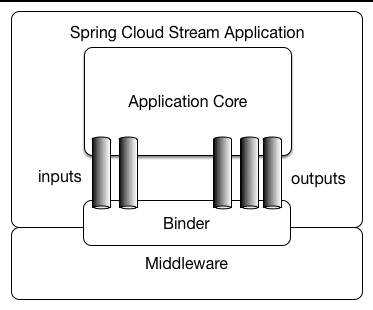

问：队列删除后，Spring Cloud Stream是否可以自动重建？

答：不可以。

项目启动后，SimpleMessageListenerContainer（SMLC）的内部类 AsyncMessageProcessingConsumer的run()方法内有一个while循环

核心问题：

1.  Spring Cloud Stream 的启动机制
    1.  为什么stream启动的时候，可以声明队列，重启的时候不可以呢？调用的不是一个方法嘛？
2.  就这个问题而言 SimpleMessageListenerContainer 是一个很重要的类
    - Spring Rabbit 就是通过它来实现消息队列重建的
    - 我能不能手动初始化它？这个思路也可以。

Spring Cloud Stream

1. 概述

   答：`Spring Cloud Stream`是`Spring Cloud`生态的一个成员，用来作为微服务架构下，消息中间件的集成方案。它能够屏蔽消息中间件的差异，在项目切换消息中间件之后无需调整业务代码，目前仅支持`RabbitMq`和`Kafka`两种消息队列。

2. 相关概念

   - binders：binder集合；binder的作用是和mq通信，屏蔽不同mq之间的差异，每个binder需要知道mq的类型和连接信息。
   - bindings：binding集合；每个binding需要知道binder、exchange和队列信息。
     - inputs：消费者channel。
     - outputs：生产者channel。

3. 结构图

   

4. 和Spring Integration的关系

   答：

5. 注解

   - `@EnableBinding`：作用在类上，用来指定一个或多个定义了`@Input`和`@Output`注解的接口。
   - `@Input`：作用在方法上，以消费者的角色绑定一个channel。
   - `@Output`：
   - `@StreamListener`：作用在方法上，指定要监听的信道，被此注解修饰的方法会消费该信道上的消息。

6. 相关问题

   1. 怎么区分生产者和消费者？

   2. 当前项目内，是rabbit推消息，还是各模块拉消息？

      答：生产者推送消息，因为项目内目前使用的是` Subscribable Channel `，该通道不保存消息。而如果使用另外一种` Pollable Channel `，则是消费者主动拉取消息，并且通道保存消息。
