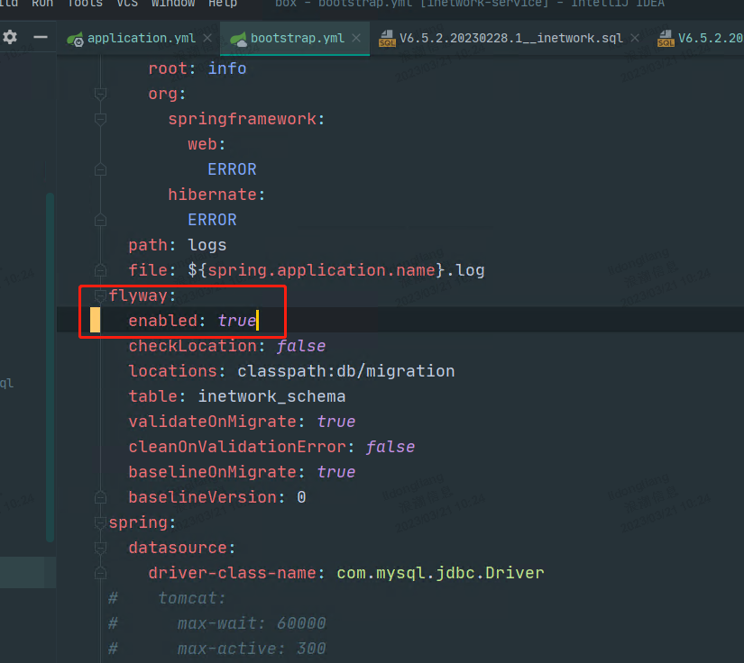
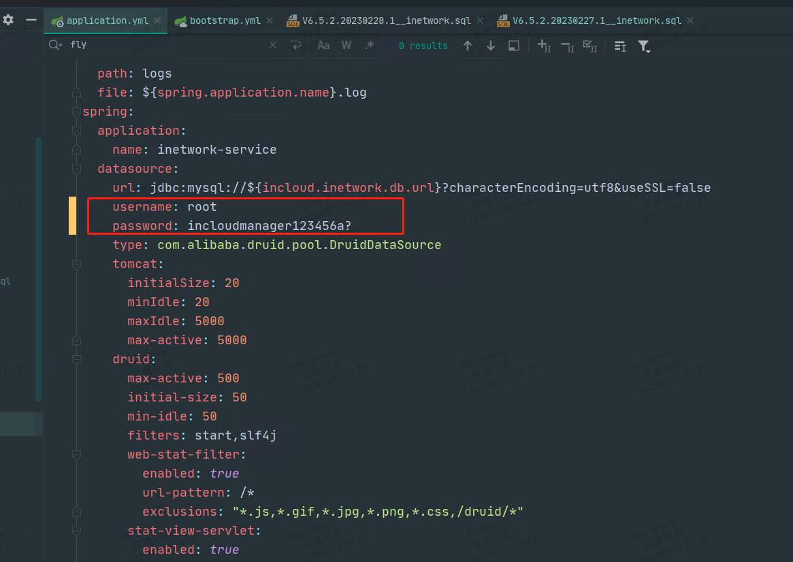
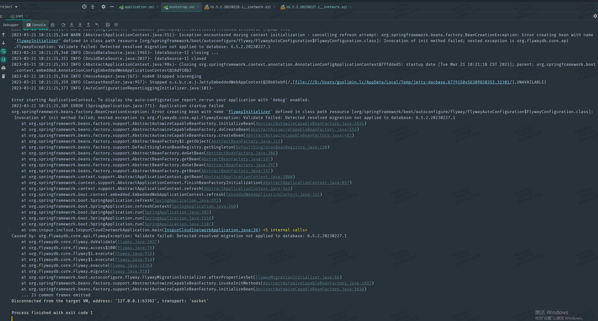

> 本地启动服务，提前验证flyway执行新增sql脚本，是否会报错的方法

1. 更新`bootstrap.yml`，开启flyway

   

2. 更新`application.yml`，更新用户名密码为`root，incloudmanager123456a?`

   

3. 本地启动服务，flyway会执行新增的sql脚本

   

4. 经测试：正常sql，sql脚本本身有问题，sql文件名有问题，都能覆盖到

**！注意：验证完还原`bootstrap.yml`和`application.yml`**