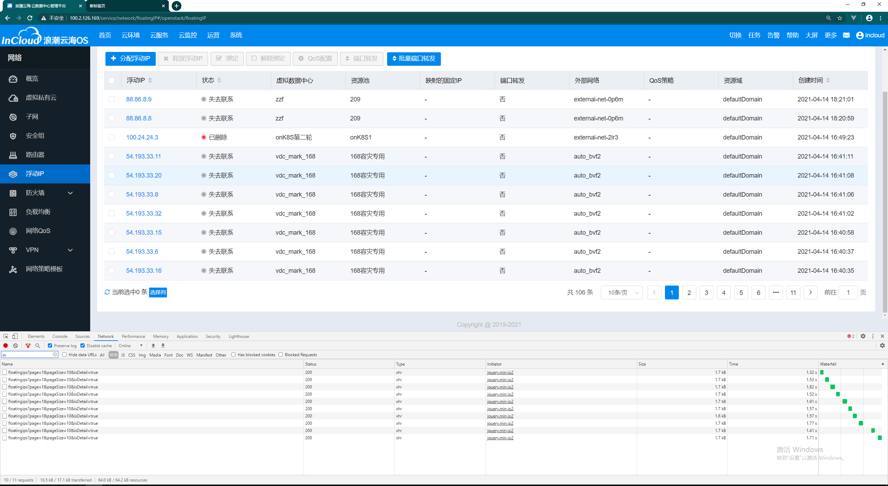
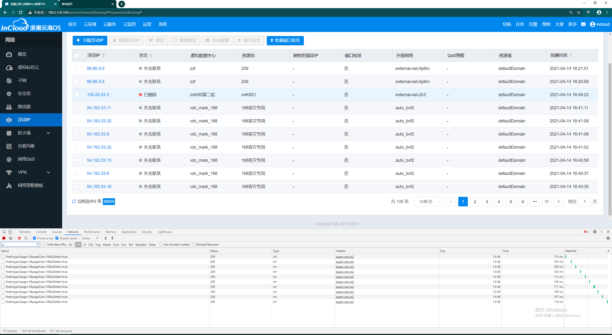
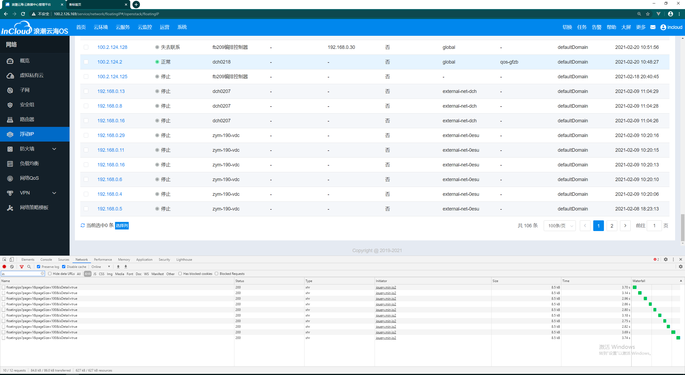
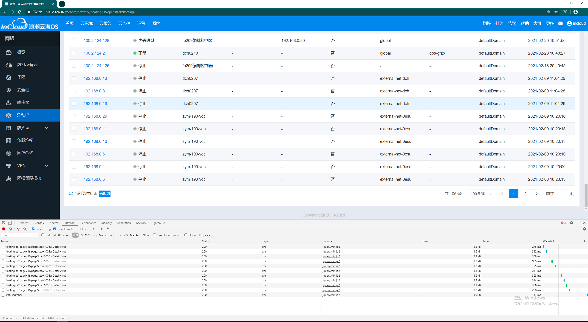

# 浮动IP接口响应时间调优


[TOC]

## 一、调优前后响应时间对比

> 原始响应时间和调优后响应时间，基于同等服务器资源条件测试得到。

### 1）10条数据响应时间对比

1. 调优前，10条平均响应时间大于1.5s：

   

2. 调优后，10条平均响应时间小于120ms：

   

### 2）100条数据响应时间对比

1. 调优前，100条平均响应时间大于3s：

   

2. 调优后，100条平均响应时间小于500ms：

   


## 二、问题分析

1. 在装配资源域、vdc、资源池、网络、QoS名称时，采用遍历全部数据库查询结果，然后逐条装配的方式。能从redis中取出的值还好，但是那些在数据库中已经删除的资源，无法从redis中取值，会反复多次调用其他模块。这个情况非常耗时。
2. isDetail属性未起到作用，导致其他查询浮动IP列表的位置，比如云主机绑定浮动IP也很慢。而实际上，云主机绑定浮动IP只需要id和ip两个参数就行，不需要全量的返回结果。
3. 装配网络名称时，调用service层查出center内全部网络，而不是dao层，耗时多。
4. 列表中查询了无用数据，比如项目名称：ProjectName。


## 三、优化方案

1. 在查询诸如vdc、网络名称之前，先把数据库查询结果中的vdcId、netId去重。然后根据去重后的id列表，利用parallelStream并发查询这些id对应的名称。最后再将这些名称装配到返回结果中。示例代码如下：

   ```java
   // 1.数据库查询
   List<FloatingIpModel> floatingIpModelList = floatingipDao.getFloatingipList(condition, page).getData();
   
   // 2.vdcId去重 & 并发查询vdc名称
   final Map<String, String> vdcIdNameMap = new HashMap<>();
   floatingIpModelList.parallelStream().map(FloatingIpModel::getVdcId).filter(Objects::nonNull).collect(Collectors.toSet()).forEach(vdcId -> {
       final String vdcName = iBaseClient.getVdcNameByVdcId(vdcId);
   	vdcIdNameMap.put(vdcId, vdcName);
   });
   
   // 3.装配vdc名称到返回结果
   List<FloatingIpApiModel> result = new ArrayList<>();
   for (FloatingIpModel floatingIpModel : floatingIpModelList) {
   	FloatingIpApiModel floatingIpApiModel = convertBase(floatingIpModel);
   	floatingIpApiModel.setVdcName(vdcIdNameMap.get(floatingIpModel.getVdcId()));
       result.add(floatingIpApiModel);
   }
   ```

2. 使用springBoot线程池，为诸如vdc、网络等每个资源查询名称开起一个线程，所有线程结束之后程序继续执行。因为列表查询中最耗时的部分是非数据库数据装配，所以这个措施能很好的提高响应速度。此外，线程由springBoot默认线程池提供，也能避免因开启线程造成的过多资源消耗。示例代码如下：

   ```java
   package com.inspur.incloud.inetwork.service.floating.ip.impl;
   
   /**
    * 异步装配名称
    * @author mark
    * @date 2021/4/19 9:04
    */
   @Component
   public class AssembleNameHandler {
   
       @Autowired
       private IBaseClient iBaseClient;
   
       @Autowired
       private INetClient iNetClient;
   
       /**
        * 异步装配vdc名称
        */
       @Async
       public Future<Object> assembleVdcName(List<FloatingIpModel> floatingIpModelList, Map<String, String> vdcIdNameMap) {
           floatingIpModelList.parallelStream()
        		.map(FloatingIpModel::getVdcId)
               .filter(Objects::nonNull)
               .collect(Collectors.toSet()).forEach(vdcId -> {
               	final String vdcName = iBaseClient.getVdcNameByVdcId(vdcId);
               	vdcIdNameMap.put(vdcId, vdcName);
           });
           return AsyncResult.forValue(null);
       }
   
       /**
        * 异步装配网络名称
        */
       @Async
       public Future<Object> assembleNetName(List<FloatingIpModel> floatingIpModelList, Map<String, String> netIdNameMap) {
           floatingIpModelList.parallelStream()
               .map(FloatingIpModel::getFloatingNetId)
               .filter(Objects::nonNull)
               .collect(Collectors.toSet()).forEach(netId -> {
               	final String netName = iNetClient.getNetNameById(netId);
               	netIdNameMap.put(netId, netName);
           });
           return AsyncResult.forValue(null);
       }
   }
   
   ```

   ```java
   package com.inspur.incloud.inetwork.service.floating.ip.impl;
   
   @Slf4j
   @Primary
   @Service("floatingipService")
   @TypeVersionAnnotation
   public class FloatingIpServiceImpl implements IFloatingIpService {
       	
       @Autowired
       private AssembleNameHandler assembleNameHandler;
       
       public List<FloatingIpApiModel> getFloatingIpList(
           List<FloatingIpModel> floatingIpModelList, Boolean isDetail) {
           
           // 1.查询floatingIpModelList列表中所有资源的名称
           final Map<String, String> vdcIdNameMap = new HashMap<>();
           final Map<String, String> netIdNameMap = new HashMap<>();
           if (isDetail) {
               List<Future<Object>> futureList = Arrays.asList(
                       assembleNameHandler.assembleVdcName(floatingIpModelList, vdcIdNameMap),
                       assembleNameHandler.assembleNetName(floatingIpModelList, netIdNameMap)
               );
   
               long start = System.currentTimeMillis();
               while (true) {
                   if (System.currentTimeMillis() - start > 5 * TimeUnit.SECOND) {
                       break;
                   }
   
                   if (futureList.parallelStream().allMatch(Future::isDone)) {
                       break;
                   }
               }
           }
   
           // 2.convert
           List<FloatingIpApiModel> result = new ArrayList<>();
           for (FloatingIpModel floatingIpModel : floatingIpModelList) {
               FloatingIpApiModel floatingIpApiModel = convertBase(floatingIpModel);
               if (isDetail) {
               	floatingIpApiModel.setVdcName(vdcIdNameMap.get(floatingIpModel.getVdcId()));    			floatingIpApiModel.setFloatingNetName(netIdNameMap
                                                     .get(floatingIpModel.getFloatingNetId()));
               }
              	result.add(floatingIpApiModel);
           }
   
           // 3.return
           return result;
       }
   }
   ```

   

## 四、方案复刻

以上解决方案，是经由多个不同方案多次尝试比较得出来的，且具有通用性，可以复刻到其他列表查询接口。


## 五、通用解决方案

1. 入参加上isDetail，如果为false，不返回domainName、vdcName、centerName等，只返回数据库查询结果
2. 常用id - name，缓存redis，这个资源审计已经做了


# 场景

## 一、本模块列表查询，装配domain、vdc、center等名称耗时

## 二、跨模块列表查询，只需要很少的数据，但是却调用了查询全量数据的接口，或接口未提供isDetail选项


