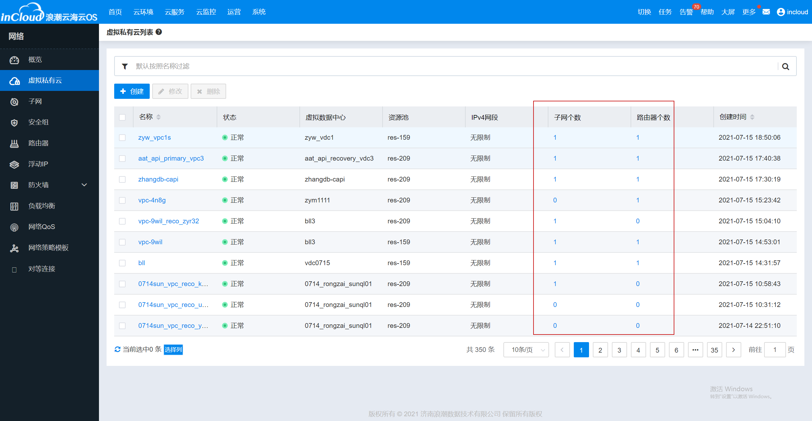

[toc]

# VPC列表接口响应时间调优

## 一、问题分析

1. 遍历列表逐条查询vdc、资源域、资源池和项目名称。

2. 每条vpc数据上需要显示vpc内网络数和路由器数，如下图所示：

   

   原始方案是遍历列表逐条查询每个vpc内的网络数和路由器数。

## 二、优化方案

1. 首先，参考浮动IP列表优化方案，为列表中vdc、资源域、资源池、项目名称查询单独开启线程。

2. 优化SQL，一次查出列表内全部vpc的网络数和路由器数，再将查询结果装配到每条vpc数据上。

   ```sql
   SELECT vpc_id vpcId, count(vpc_id) netNum FROM t_net_net WHERE vpc_id in ('" + vpcIds + "') GROUP BY vpc_id;
   SELECT vpc_id vpcId, count(vpc_id) routerNum FROM t_net_router WHERE vpc_id in ('" + vpcIds + "') GROUP BY vpc_id;
   ```

   

   ```java
   Map<String, Integer> netNumMap = new HashMap<>();
   Map<String, Integer> routerNumMap = new HashMap<>();
   
   if (isDetail) {
       // 网络数量
       final Set<String> vpcIdSet = vpcList.parallelStream().map(VpcModel::getId).collect(Collectors.toSet());
       final String vpcIds = String.join("','", vpcIdSet);
       final List<Map<String, Object>> netNumList = vpcDao.countNetInVpcs(vpcIds);
       for (Map<String, Object> map : netNumList) {
           final String vpcId = (String) map.get("vpcId");
           final Long netNum = (Long) map.get("netNum");
           if (vpcId != null && netNum != null) {
               netNumMap.put(vpcId, netNum.intValue());
           }
       }
   
       // 路由器数量
       final List<Map<String, Object>> routerNumList = vpcDao.countRouterInVpcs(vpcIds);
       for (Map<String, Object> map : routerNumList) {
           final String vpcId = (String) map.get("vpcId");
           final Long routerNum = (Long) map.get("routerNum");
           if (vpcId != null && routerNum != null) {
               routerNumMap.put(vpcId, routerNum.intValue());
           }
       }
   
       List<VpcApiModel> result = new ArrayList<>();
       for (VpcModel vpc : vpcList) {
           VpcApiModel vpcApiModel = new VpcApiModel();
   
           String vpcId = vpc.getId();
           if (isDetail) {
               vpcApiModel.setNetNum(netNumMap.get(vpcId) == null ? 0 : netNumMap.get(vpcId));
               vpcApiModel.setRouterNum(routerNumMap.get(vpcId) == null ? 0 : routerNumMap.get(vpcId));
      	 	}
   
           result.add(vpcApiModel);
       }
       
   }
   ```

   

   