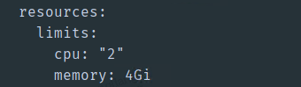
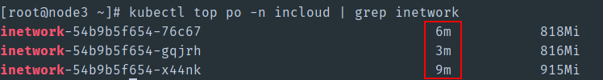
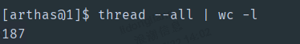
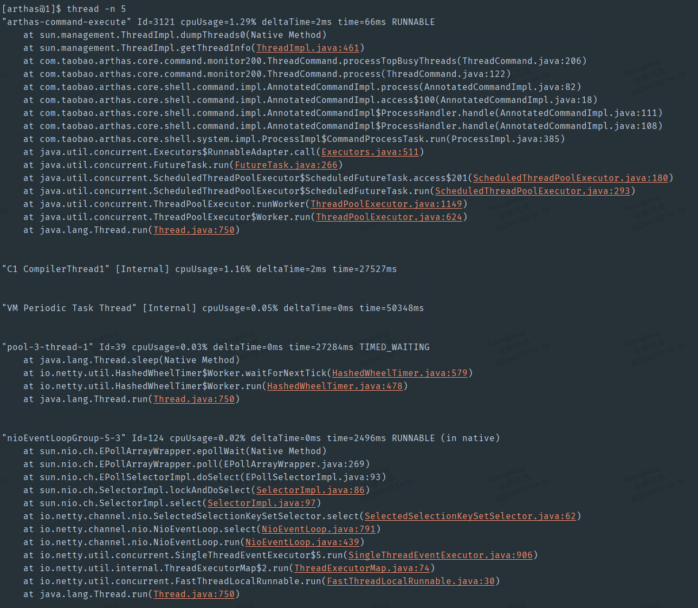
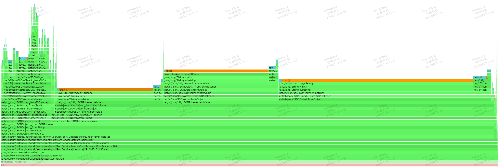

**容器CPU满载问题诊断思路**

1. 问题现象

   1. 最直接的现象，是该模块相关功能（通过页面或者自动化测试触发），响应变慢甚至超时。

   2. k8s命令查看

      1. 例如在deploy配置中，inetwork的配额是2核4g

         

      2. 使用`kubectl top po -n incloud | grep inetwork` 命令查看inetwork pod的cpu负载
      
         
      
         这里的单位是m的含义是  1000m=1核，所以如果该列的值接近或者超过2000m，代表该pod cpu接近满载。

2. 可能原因
   1. 系统内线程数量过多。
   2. 死循环。
   3. Full GC次数增大。

3. 定位方法
   1. 查看线程总数是否过高
   
      曾经出现过的一个问题，由于业务模块不合理的创建线程池，导致同时存活超过10000个线程。
   
      虽然每个线程的负载不高，但是消耗在线程之间上下文切换的CPU过高，进而导致整个系统响应迟滞。
   
      这里我们借助arthas观测系统内线程，示例如下：
   
      - 查看线程总数：`thread --all | wc -l`
   
      
   
      - 查看占CPU负载前5的线程：`thread -n 5`
   
        
   
      - 查看全部线程堆栈，按照CPU负载从高到底排序，并导出为容器内某个文件：`thread -n -1 > a`
   
   2. 借助火焰图直观的观测CPU时间片消耗在哪里
   
      生成火焰图，这里我们使用arthas的profiler命令：
   
      - 开始收集：`profiler start -e cpu`。
   
      - 等待一段时间，过程中可以使用命令`profiler status`查看收集时长，使用命令`profiler getSamples`查看已经收集的样本数。
   
      - 停止收集：`profiler stop`，默认生成html格式的火焰图，存储在容器内的指定位置。
   
      阅读火焰图：
   
      
   
      Arthas的profiler命令收集CPU的执行样本，如30s收集到10000个样本，生成如上火焰图。
   
      y 轴表示调用栈，每一层都是一个函数。调用栈越深，火焰就越高，顶部就是正在执行的函数，下方都是它的父函数。
   
      x 轴表示抽样数，如果一个函数在 x 轴占据的宽度越宽，就表示它被抽到的次数多，即执行的时间长。注意，x 轴不代表时间，而是所有的调用栈合并后，按字母顺序排列的。
   
      **火焰图就是看顶层的哪个函数占据的宽度最大。只要有"平顶"（plateaus），就表示该函数可能存在性能问题。**
   
      颜色没有特殊含义，因为火焰图表示的是 CPU 的繁忙程度，所以一般选择暖色调。
   
      不同时间段收集到的火焰图不同，如果想得到清晰的火焰图，需要多收集几次。
   
4. 预防方法

   在新增一个函数后，如果包含多线程的应用，或者代码里存在while死循环，或者担心占用内存过大频繁的触发gc。可以在提交测试之前，使用**jmeter并发压测**，同时观察cpu负载及系统响应速度。

参考资料：

- [如何读懂火焰图？](http://www.ruanyifeng.com/blog/2017/09/flame-graph.html)

