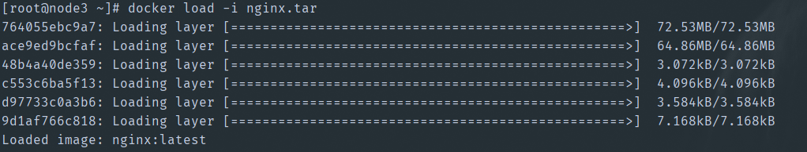
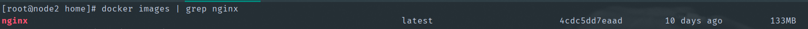
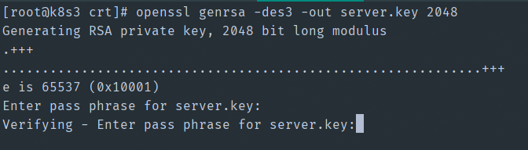
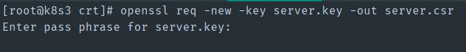
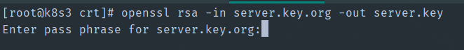
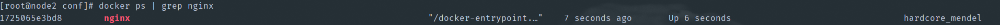
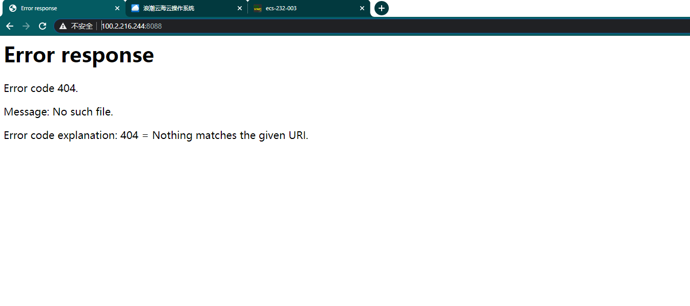
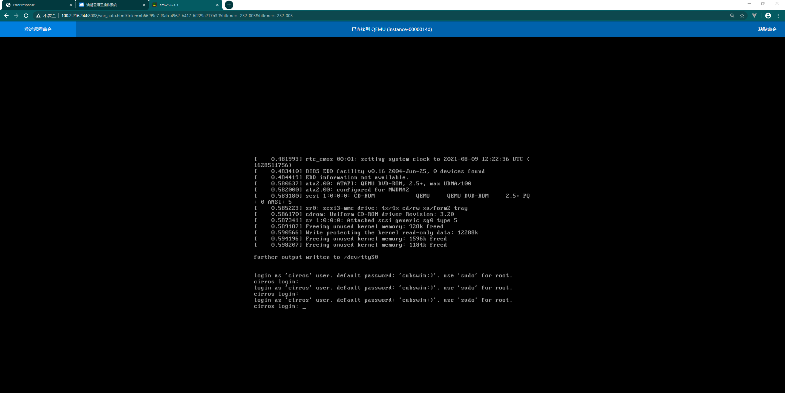

[toc]

# 反向代理https访问Ecs控制台解决方案

## 一、导入Nginx镜像

1. 上传nginx.tar包到ICM任意节点

2. 执行命令：docker load -i nginx.tar，导入nginx镜像

   

3. 执行命令：docker images | grep nginx，若出现下图，则证明nginx镜像导入成功

   


## 二、生成自签名证书

1. 生成RSA私钥

   1.1.输入命令：

   ```ssh
   openssl genrsa -des3 -out server.key 2048
   ```

   1.2.输入并确认私钥密码：

   

   1.3.最终生成文件`server.key`

2. 生成CSR

   2.1.命令：

   ```ssh
   openssl req -new -key server.key -out server.csr
   ```

   2.2.输入私钥密码：

   

   2.3.依次输入国家，地区，城市，组织，组织单位，Common Name和Email（真实性并不重要）。

   eg：

   ```ssh
   Country Name (2 letter code) [AU]:CN
   State or Province Name (full name) [Some-State]:Beijing
   Locality Name (eg, city) []:Beijing
   Organization Name (eg, company) [Internet Widgits Pty Ltd]:joyios
   Organizational Unit Name (eg, section) []:info technology
   Common Name (e.g. server FQDN or YOUR name) []:demo.joyios.com
   Email Address []:liufan@joyios.com
   ```

   2.4.最终生成文件`server.csr`

3. 删除私钥中的密码

   3.1.命令

   ```sh
   $ cp server.key server.key.org
   $ openssl rsa -in server.key.org -out server.key
   ```

   3.2.输入私钥密码：

   

4. 生成自签名证书

   4.1.命令：

   ```sh
   openssl x509 -req -days 3650 -in server.csr -signkey server.key -out server.crt
   ```

   4.2.最终生成文件`server.crt`


## 三、上传Nginx配置文件

1. 在nginx镜像所在ICM节点，执行命令：mkdir -p /data/nginx/{conf,log}，创建挂载目录
2. 将配置文件nginx.conf上传至/data/nginx/conf目录
3. 将配置文件default.conf上传至/data/nginx/conf目录
4. 将步骤二生成的证书文件`server.key`、`server.crt`拷贝至/data/nginx/conf目录


## 四、启动Nginx镜像

1. 在nginx镜像所在ICM节点，执行命令，启动nginx镜像：

   ```sh
   docker run --network host -d -v /data/nginx/conf/nginx.conf:/etc/nginx/nginx.conf -v /data/nginx/conf/default.conf:/etc/nginx/conf.d/default.conf -v /data/nginx/conf/server.key:/etc/nginx/server.key -v /data/nginx/conf/server.crt:/etc/nginx/server.crt -v /data/nginx/log:/var/log/nginx nginx
   ```

2. 执行命令：docker ps | grep nginx，若出现下图，则证明nginx镜像启动命令执行成功

   

3. 浏览器访问`https://节点IP + 8088`端口，若出现下图，则证明nginx启动成功


## 五、反向代理访问控制台

1. 打开任意一个云主机vnc控制台

2. 替换vnc访问路径中的域名或ip端口为部署nginx的节点ip+8088端口，替换后访问vnc效果如下：

   