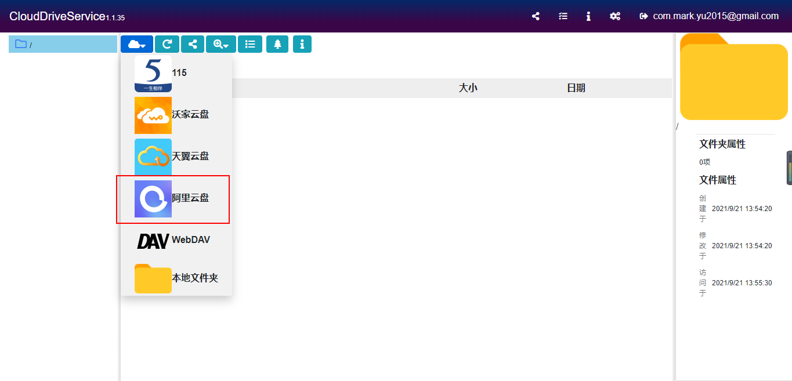
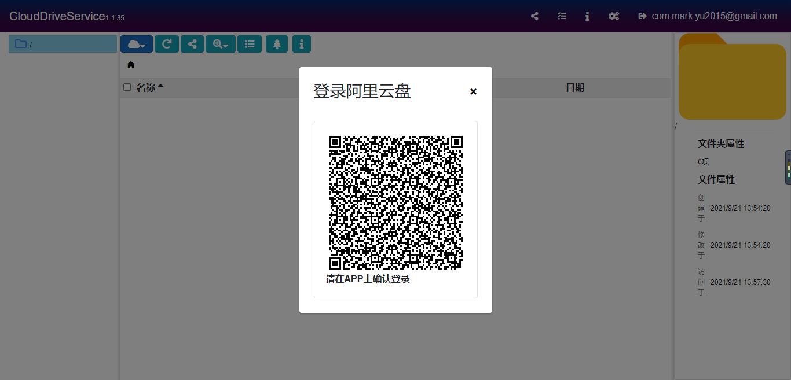
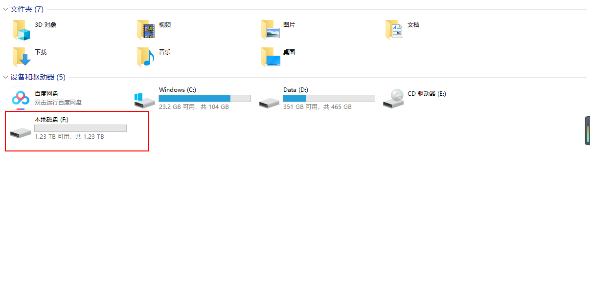

# 挂载阿里云盘到本地目录

[toc]

> 本文档用于说明如何将阿里云盘挂载在本地目录

## 一、阿里云盘

1. 阿里云盘目前有三个优点：一是容量非常大；二是不限速；三是可以挂载到本地，作为一块共享盘在不同电脑之间使用。
2. 邀请码：https://pages.aliyundrive.com/mobile-page/web/beinvited.html?code=688a375。通过这个邀请码注册会送你500G存储。
3. 从手机应用市场上搜索“阿里云盘”并安装。（桌面端也可以安装，但是下面的CloudDrive登录需要手机端扫码）


## 二、Cloud Drive

1. Cloud Drive是一个工具，可以帮助我们把阿里云盘挂载到本地目录。

2. 下载Cloud Drive，百度盘链接如下：

   ```sh
   链接：https://pan.baidu.com/s/1hW-WR0p99ejIPVs4SG0GzQ 
   提取码：yxr2
   ```

3. 按照提示一步一步安装即可。
4. 安装完成后，通过浏览器输入地址http://localhost:9798/访问。首次登录需要先用邮箱注册。


## 三、挂载

使用Cloud Drive挂载阿里云盘非常简单，操作步骤如下：

1. 选择阿里云盘

   

2. 登录阿里云盘

   

3. 打开我的电脑就可以看到已挂载的阿里云盘了

   
4. 通过将同一个阿里云盘挂载到不同电脑，您就可以实现不同电脑之间使用同一块共享磁盘的功能了。


莫迟疑